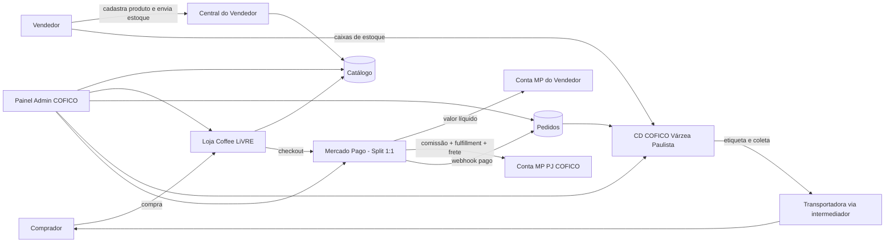
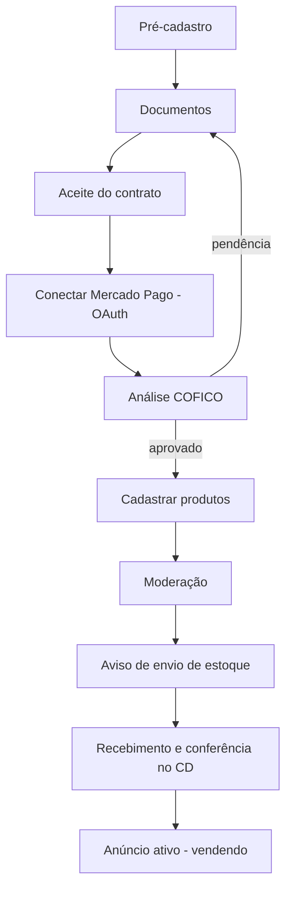
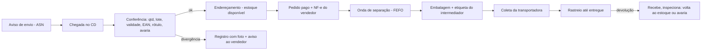

# RAIO-X OPERACIONAL — COFFEE LiVRE
### O marketplace do café · Operado pela COFICO Brasil (V. Medeiros de Santi Ltda · CNPJ 66.006.929/0001-36)

**Versão:** v1 — 11/09/2026  
**Uso:** documento oficial de arquitetura operacional do Coffee LiVRE. É a fonte de verdade para o Claude Code implementar o painel administrativo, a central do vendedor, pedidos, pagamentos com split e fulfillment. Evoluir **sempre este mesmo arquivo** (não criar versões paralelas).

---

## 0. Como ler este documento

- **FATO** = regra pública de terceiros (Mercado Pago, Mercado Livre, legislação), com fonte no fim.
- **RECOMENDAÇÃO** = proposta técnica/comercial deste documento. Pode ser aprovada, alterada ou recusada.
- **DECISÃO HUMANA** = escolha que só o Vlademir/Diretoria pode fazer. Lista consolidada na seção 14.
- **PENDENTE** = depende de contador, jurídico, Mercado Pago ou documento oficial. Não implementar regra definitiva antes da resposta. Lista consolidada na seção 15.

**Transparência sobre a origem:** o painel administrativo interno do Mercado Livre **não é público** — ninguém de fora consegue fazer varredura dele. O que está aqui é (1) a arquitetura padrão de marketplaces (Mercado Livre, Shopee, Amazon, Magalu funcionam com os mesmos blocos), (2) as regras públicas que o ML e o MP divulgam aos vendedores, e (3) a documentação oficial do Mercado Pago para split de pagamentos. Nada foi copiado de sistema de terceiros.

---

## 1. Visão geral — como um marketplace funciona por trás

Um marketplace tem **3 lados** e **5 motores**, todos controlados por **um painel administrativo**.

**Os 3 lados**
1. **Comprador** — navega, compra, paga, recebe, avalia, reclama.
2. **Vendedor** (produtor, torrefação, quem embala café) — cadastra a empresa, cadastra produtos, envia estoque, recebe o dinheiro.
3. **Operadora (COFICO)** — dona da plataforma: aprova vendedores, modera, cobra comissão, guarda e despacha o estoque, atende, decide disputas.

**Os 5 motores**
| Motor | O que faz | Quem mexe |
|---|---|---|
| Catálogo | Categorias, atributos, produtos, preços, fotos, busca | Vendedor cadastra · Admin modera |
| Vitrine (CMS) | Home, banners, carrosséis, ofertas, destaques pagos | Admin (conteúdo/marketing) |
| Pedidos | Carrinho, checkout, status, cancelamento, devolução | Sistema + Admin + CD |
| Pagamentos | Cobrança, split, comissão, reembolso, conciliação | Mercado Pago + Sistema + Financeiro |
| Logística | Recebimento de estoque, armazenagem, separação, envio, rastreio | CD Várzea Paulista (COFICO) |



---

## 2. Modelo de operação recomendado para largar (RECOMENDAÇÃO)

**"Marketplace 3P com Fulfillment LiVRE obrigatório"**

1. O vendedor é o **dono do produto** e o **vendedor legal** (emite a NF-e de venda ao consumidor).
2. O vendedor **envia o estoque para o CD da COFICO em Várzea Paulista** antes de vender. Sem estoque conferido no CD, o anúncio não fica ativo.
3. O comprador paga pelo **Mercado Pago com Split 1:1**: o dinheiro cai **direto na conta Mercado Pago do vendedor**, e a parte da COFICO (comissão + tarifa de fulfillment + frete) cai **direto na conta Mercado Pago PJ da COFICO**, no mesmo pagamento.
4. A COFICO **separa, embala e despacha** pelo intermediador de frete (padrão CarrierAdapter já decidido: Melhor Envio / Kangu / Frenet / SuperFrete).
5. A COFICO **nunca guarda dinheiro do vendedor**. Só recebe o que é dela.

**Por que este modelo (e não outro)**
| Critério | 3P + Fulfillment (recomendado) | 1P / Consignação (COFICO compra e revende) | 3P com envio pelo vendedor |
|---|---|---|---|
| Garantia de entrega | **Alta** — o produto já está no CD da COFICO | Alta | **Baixa** — dinheiro já saiu, vendedor pode falhar |
| Dinheiro de terceiros com a COFICO | Não (split) | Sim (COFICO recebe tudo e repassa) | Não |
| Risco regulatório Banco Central | Baixo (quem custodia é o MP) | Médio/alto se repassar valores de terceiros | Baixo |
| Faturamento que conta para o Simples Nacional da COFICO | Só comissão/serviços | **Venda cheia** — pode estourar o teto do Simples | Só comissão |
| Complexidade fiscal | Média (remessa para armazenagem) | Alta (consignação) | Baixa |
| Experiência do comprador | Entrega rápida e padronizada | Igual | Irregular |

> **Atenção fiscal (PENDENTE contador):** no modelo 1P toda a venda vira receita da COFICO; no 3P só a comissão e os serviços. Isso muda regime, alíquota e teto do Simples. Validar antes de decidir.

**Loja própria da COFICO dentro do marketplace (DECISÃO HUMANA D6):** as marcas que a própria COFICO vende (Saporino, Café Fazendinha como distribuidora oficial) podem aparecer como uma loja normal. Nesse caso a venda é da própria COFICO e o pagamento usa a credencial da conta PJ COFICO **sem split** (marketplace_fee = 0).

---

## 3. Arquitetura técnica (resumo para o Claude Code)

- **Stack atual do projeto:** Vite + React + TS + Tailwind + Supabase + Vercel. Roteamento custom em `src/App.tsx`.
- **Endereço:** `coficobrasil.com.br/coffeelivre` (decidido), com trava por código compartilhado até o lançamento (decidido). A trava é provisória e não substitui o login real de comprador/vendedor.
- **Isolamento:** todas as tabelas do marketplace com prefixo **`lv_`** (Coffee LiVRE), no mesmo projeto Supabase, com RLS própria. Nada do RepCo, Saporino ou COFICO Last Mile é alterado.
- **Onde fica o admin (DECISÃO HUMANA D1 — recomendação):** área própria `/coffeelivre/admin` no mesmo código e mesmo login do sistema, com permissões `lv_*`. Como o painel mestre é o admin do RepCo, depois se cria uma aba "Coffee LiVRE" no admin do RepCo apontando para essa área. A interligação com o RepCo fica para depois (decidido).
- **Chamadas ao Mercado Pago:** **só no backend** (Supabase Edge Functions). Nunca token no frontend.
- **Segredos:** novos segredos com prefixo `LV_MP_*` da aplicação **Marketplace** da conta **PJ COFICO**. **Proibido** reaproveitar `MERCADO_PAGO_ACCESS_TOKEN` / `MERCADO_PAGO_WEBHOOK_SECRET` existentes (são da conta PF e servem ao site atual — não mexer).
- **Tokens dos vendedores (OAuth):** tabela separada `lv_seller_mp_credentials`, criptografada (Supabase Vault ou pgcrypto), acessível só pelo service role.
- **Imagens:** Supabase Storage, bucket `lv-public` (produtos, banners) e bucket privado `lv-private` (documentos de vendedor, NF-e, comprovantes).
- **Busca:** Postgres full text (`tsvector` em português) + `pg_trgm` para tolerância a erro de digitação.
- **Jobs agendados:** `pg_cron` ou Edge Function agendada (ver seção 11).
- **Auditoria:** toda ação de admin grava em `lv_admin_audit_log` (quem, quando, o quê, antes/depois).

**Áreas do sistema**
| Área | Rota sugerida | Quem usa |
|---|---|---|
| Loja pública | `/coffeelivre` e subpáginas (categoria, produto, loja, busca, carrinho, checkout) | Comprador |
| Minha conta | `/coffeelivre/conta` | Comprador |
| Central do Vendedor | `/coffeelivre/vendedor` | Vendedor e equipe dele |
| Painel Administrativo | `/coffeelivre/admin` | Equipe COFICO por papel |
| Operação do CD | `/coffeelivre/admin/cd` (tela simplificada, boa para tablet) | Equipe do galpão |

---
## 4. O PAINEL ADMINISTRATIVO — o que acontece por trás das cenas

Cada módulo abaixo traz: **para que serve**, **telas**, **regras** e **tabelas** (detalhe das tabelas na seção 10).

### 4.1 Dashboard (visão geral do negócio)
**Para que serve:** ver a saúde do marketplace em uma tela.

**Indicadores (com definição exata, para não haver dúvida no cálculo):**
| Indicador | Definição |
|---|---|
| GMV | Soma de (produtos + frete) dos pedidos com pagamento aprovado no período, menos cancelados e reembolsados |
| Receita LiVRE | Soma do `marketplace_fee` efetivamente recebido (comissão + fulfillment + frete) menos estornos proporcionais |
| Receita líquida LiVRE | Receita LiVRE − custo real de frete pago à transportadora − custo de embalagem |
| Pedidos | Pedidos pagos no período (e por status) |
| Ticket médio | GMV ÷ pedidos pagos |
| Conversão | Pedidos pagos ÷ sessões na loja (quando houver analytics) |
| Compradores ativos | Compradores com ≥ 1 pedido pago nos últimos 90 dias |
| Compradores novos | Primeiro pedido pago dentro do período |
| Vendedores ativos | Vendedores aprovados com ≥ 1 anúncio ativo e estoque > 0 no CD |
| Vendedores em onboarding | Cadastro iniciado e ainda não aprovado (por etapa) |
| Assinantes ativos | Assinaturas com status ativo (quando o módulo 4.10 existir) |
| Anunciantes ativos | Campanhas de anúncio/banner pago em veiculação |
| Estoque no CD | Unidades e valor (preço de venda) por vendedor; itens com validade < 60 dias |
| Operação | Pedidos aguardando NF, aguardando separação, atrasados (> SLA), devoluções abertas |
| Qualidade | Reclamações abertas, taxa de reclamação, nota média, cancelamentos |

**Telas:** cartões de KPI com comparação ao período anterior · gráfico de GMV e pedidos por dia · top 10 produtos · top 10 vendedores · vendas por categoria · vendas por meio de pagamento · mapa por estado · fila de alertas (pedidos travados, tokens do MP perto de vencer, estoque vencendo).

**Filtros:** período (hoje, 7d, 30d, mês, personalizado), vendedor, categoria, meio de pagamento.

### 4.2 Vitrine / CMS da Home (o site muda sem programador)
**Para que serve:** montar e mudar a home e as páginas de campanha pelo painel.

**Como funciona por dentro:** a home **não é mais código fixo**. Ela é uma **lista ordenada de seções** guardada no banco (`lv_home_sections`). O frontend lê essa lista e desenha cada seção pelo tipo. Mudou no painel → mudou no site.

**Tipos de seção (espelham o mockup aprovado):** `hero_carousel` · `highlight_cards` · `benefits_bar` · `harvest_banner` (faixa Colheita) · `product_carousel` · `promo_banners` (duplo) · `category_grid` · `origin_grid` · `store_grid` · `seller_cta` · `newsletter`.

**Cada seção tem:** título · ordem (arrastar e soltar) · ligada/desligada · data e hora de início e fim · público (todos / visitante / cliente novo / cliente logado) · conteúdo (`payload` em JSON validado por tipo).

**Carrossel de produtos — fonte dos itens:**
- `manual` (admin escolhe produtos);
- `regra` → `ofertas_ativas`, `mais_vendidos_30d`, `novidades`, `categoria:<id>`, `loja:<id>`, `patrocinados`.
Produtos sem estoque ou pausados **somem sozinhos** do carrossel.

**Banners (`lv_banners`):** posição (`home_hero`, `home_duplo_esq`, `home_duplo_dir`, `categoria_topo`, `busca_topo`, `produto_lateral`) · imagem desktop e imagem celular (tamanhos fixos por posição; o upload valida dimensão e peso) · texto alternativo · link · início/fim · prioridade · anunciante (se for pago) · contagem de impressões e cliques.

**Fluxo de publicação:** rascunho → pré-visualização (a página renderizada como o cliente verá) → publicar agora ou agendar. Histórico de versões com "restaurar".

**Também editável aqui:** menu de categorias do cabeçalho (ordem e destaque), textos da faixa de benefícios, rodapé (links), faixa de aviso no topo, SEO da home (título, descrição, imagem de compartilhamento).

### 4.3 Catálogo e Categorias (categoria criada = site ajustado sozinho)
**Árvore de categorias (`lv_categories`):** até 3 níveis (ex.: Café em grãos › Especiais › Microlotes). Campos: nome, slug (URL), ícone, imagem, ordem, ativa/oculta, SEO, **atributos da categoria**.

**Atributos por categoria (`lv_category_attributes`)** — é isso que faz o formulário do vendedor e os filtros da loja mudarem sozinhos:
| Atributo | Tipo | Exemplo de categoria |
|---|---|---|
| Tipo de torra | lista (clara, média, média-escura, escura) | Grãos, Moído |
| Moagem | lista (grão, fina, média, grossa) | Moído |
| Origem / região | lista (Sul de Minas, Cerrado Mineiro, Mogiana, Mantiqueira, Chapada Diamantina, Montanhas do ES, Matas de Rondônia, Norte Pioneiro…) | Todas de café |
| Espécie | lista (arábica, canéfora/conilon/robusta) | Todas de café |
| Variedade | texto | Especiais |
| Processo | lista (natural, cereja descascado, lavado, fermentado, honey) | Especiais |
| Pontuação SCA | número 0–100 + laudo (arquivo) | Especiais |
| Classificação MAPA | lista (tradicional, extraforte, superior, gourmet) | Torrado e moído |
| Peso líquido | número (g) | Todas |
| Data de torra / validade | data / meses | Todas de café |
| Certificações | múltipla (orgânico, fair trade, Rainforest…) + comprovante | Todas |
| Compatibilidade | lista (Nespresso, Dolce Gusto…) | Cápsulas |

Cada atributo: obrigatório sim/não · aparece como filtro sim/não · aparece no card sim/não · ordem.

**O que acontece sozinho quando o admin cria, oculta ou renomeia uma categoria:**
- menu "Categorias" do cabeçalho e grid de categorias da home se atualizam;
- página da categoria nasce com filtros baseados nos atributos;
- formulário de cadastro de produto da Central do Vendedor passa a pedir os atributos;
- `sitemap.xml` e breadcrumbs se atualizam;
- se o slug mudar, grava redirecionamento (`lv_redirects`) da URL antiga para a nova.

**Regras:** categoria com produtos **não pode ser apagada** — só ocultada, ou os produtos precisam ser movidos antes (tela de mover em lote). Categoria oculta some da loja, mas os pedidos antigos continuam íntegros.

**Moderação de anúncios:** todo produto novo ou editado em campo sensível (título, fotos, preço com queda > 50%, categoria) entra em fila `em_moderacao`. O admin aprova, recusa (com motivo padronizado) ou pede ajuste. Checklist de moderação: foto real do produto, rótulo legível, peso líquido, validade, classificação, sem marca de terceiros, sem promessa de saúde, preço coerente.

### 4.4 Vendedores
**Telas:** lista com filtros por status · ficha do vendedor (dados, documentos, contrato aceito e versão, conexão Mercado Pago, plano de comissão, estoque no CD, pedidos, reputação, faturas, histórico) · fila de aprovação.

**Status do vendedor:** `rascunho` → `documentos_enviados` → `em_analise` → `aprovado` → (`suspenso` ↔ `aprovado`) → `encerrado`. Também `recusado`.

**Ações do admin:** aprovar/recusar (motivo obrigatório) · pedir documento · definir plano de comissão (padrão ou especial por vendedor, com vigência) · suspender (pausa todos os anúncios na hora) · encerrar (exige estoque zerado no CD e sem pedidos abertos) · reenviar convite de conexão ao Mercado Pago.

**Alertas automáticos:** token do Mercado Pago do vendedor vencendo (renovação automática falhou) · documento vencido (alvará, certificado) · reputação caiu de faixa.

### 4.5 Pedidos
**Regra estrutural:** **1 pedido = 1 vendedor = 1 pagamento no Mercado Pago** (exigência do Split 1:1). Se o comprador compra de 2 lojas, nascem 2 pedidos ligados por um `checkout_group` (ver 6.4).

**Máquina de status do pedido:**
```
aguardando_pagamento → pago → aguardando_nf → em_separacao → embalado → enviado → entregue → concluido
                       ↘ cancelado (sem pagamento em 24h / pagamento recusado / cancelamento antes da separação)
entregue → em_devolucao → devolvido → reembolsado
qualquer status pago → em_disputa (reclamação aberta) → resolvido
```
Cada mudança grava `lv_order_status_history` (quem, quando, motivo).

**Telas:** lista com filtros (status, vendedor, data, UF, meio de pagamento, atrasados) · detalhe do pedido (itens, valores, split — quanto foi para o vendedor e para a COFICO —, pagamento, NF-e, etiqueta, rastreio, linha do tempo, mensagens) · ações: cancelar, reembolsar total/parcial, reenviar etiqueta, marcar extravio, abrir disputa.

**SLAs (valores PENDENTES de decisão D8):** pagamento Pix expira em 30 min; pedido sem pagamento cancela em 24 h; NF-e do vendedor em até 1 dia útil; separação e despacho em até 1 dia útil após a NF.

### 4.6 Pagamentos e Financeiro
**Fonte da verdade:** webhooks do Mercado Pago + relatório "Vendas com split" do MP (via API) para conciliação diária.

**Telas:**
- **Pagamentos:** cada pagamento com status do MP, valor total, taxa do MP, `marketplace_fee`, valor líquido do vendedor, data de liberação.
- **Razão de tarifas (`lv_fees_ledger`, só inclusão, nunca edição):** cada centavo da COFICO por pedido — comissão, fulfillment, frete cobrado, ajustes, estornos.
- **Conciliação:** diferenças entre o que o sistema esperava e o que o MP informou (alerta).
- **Faturas ao vendedor (`lv_seller_invoices`):** o que **não cabe** no `marketplace_fee` de um pedido é cobrado por fatura mensal — armazenagem, estoque parado, anúncios patrocinados, retirada de estoque, multas contratuais. Cobrança por Pix/boleto da conta PJ COFICO. Fatura vencida → anúncios pausados após X dias (PENDENTE jurídico: direito de reter o estoque como garantia).
- **Repasses:** não existem (o MP já paga o vendedor direto). A tela mostra ao vendedor o que ele recebeu e quando o MP libera.
- **Notas da COFICO:** a COFICO emite nota de serviço ao vendedor pelas comissões e serviços (PENDENTE contador: tipo de nota, município, tributação da intermediação).

### 4.7 Promoções, Ofertas e Cupons
**Tipos:**
| Tipo | Como funciona | Quem financia |
|---|---|---|
| Preço promocional | "De/Por" com início e fim | Vendedor |
| Oferta relâmpago | Preço especial + limite de unidades + barra de estoque + contador | Vendedor (a LiVRE pode dividir) |
| Kit / leve X pague Y | Preço por quantidade | Vendedor |
| Frete grátis de campanha | Frete grátis em faixa ou categoria | LiVRE ou vendedor |
| Cupom | Código, % ou R$, pedido mínimo, validade, limite total, limite por CPF, 1ª compra, escopo (tudo/categoria/loja/produto) | Vendedor, LiVRE ou dividido |
| Campanha sazonal | Página própria (ex.: "Semana do Especial") montada no CMS com produtos inscritos | Vendedores inscritos |

**Regra crítica do split (FATO + RECOMENDAÇÃO):** no Split 1:1 o comprador paga o valor já com desconto e o dinheiro vai direto ao vendedor. Para a LiVRE financiar um desconto sem ter que transferir dinheiro ao vendedor, o desconto **é abatido do `marketplace_fee` daquele pedido**. Por isso: **cupom financiado pela LiVRE ≤ `marketplace_fee` do pedido**. Se passar disso, o sistema limita automaticamente o desconto.

**Inscrição em campanha:** a LiVRE cria a campanha com regras (desconto mínimo, categorias) → vendedores se inscrevem pela Central → admin aprova os itens → campanha entra no ar no horário.

**Antifraude de cupom:** limite por CPF e por cartão/dispositivo, bloqueio de autocompra do vendedor, relatório de uso.

### 4.8 Anúncios patrocinados e anunciantes
**Para que serve:** receita extra além da comissão (é assim que os grandes marketplaces ganham margem).

**Produtos:**
- **Produto patrocinado:** aparece com selo "Patrocinado" no topo da busca, da categoria e no carrossel `patrocinados`.
- **Banner pago:** posições do CMS vendidas por período.
- **Loja em destaque:** vitrine da loja na seção `store_grid`.

**Modelo de cobrança para largar (RECOMENDAÇÃO):** **pacote fixo por período** (ex.: semana de banner, mês de produto patrocinado), cobrado na fatura do vendedor. Cobrança por clique (CPC) com leilão só na fase 4. **Anunciante** pode ser vendedor ou marca externa (equipamentos, cafeteiras, cursos) — marca externa paga por Pix/boleto antes da veiculação.

**Telas:** inventário de espaços com calendário de ocupação · campanhas (anunciante, espaço, período, criativo, valor, status) · relatório de impressões, cliques e vendas atribuídas.

### 4.9 Clientes (compradores)
Lista com filtros (ativo 90 dias, novo, recorrente, inativo, bloqueado) · ficha (pedidos, valor total gasto, endereços, cupons usados, reclamações, avaliações) · bloquear/desbloquear · **LGPD:** exportar dados do titular e anonimizar sob pedido (mantendo o que a lei fiscal obriga guardar).

### 4.10 Assinaturas (clube do café) — fase 4
Assinatura de produto recorrente (ex.: 500 g a cada 30 dias). **PENDENTE Mercado Pago:** confirmar se as assinaturas (preapproval) aceitam split de marketplace. Alternativa: a LiVRE gera um pedido novo a cada ciclo e cobra com o cartão salvo usando o Checkout Transparente com `application_fee`. Até a confirmação, o módulo fica desligado e o KPI "assinantes" mostra zero.

### 4.11 Logística e Fulfillment (CD Várzea Paulista)
Detalhado na seção 8. No painel: recebimentos agendados, divergências, estoque por vendedor/SKU/lote/validade, filas de separação e embalagem, expedição, devoluções, estoque parado, inventário.

### 4.12 Atendimento, reclamações e mediação
Tickets por pedido · mensagens comprador ↔ LiVRE ↔ vendedor (com filtro que bloqueia telefone, e-mail e link externo nas mensagens) · motivos padronizados (não recebi, chegou avariado, produto diferente, validade, arrependimento) · prazos · decisão do admin (reembolso total, parcial, reenvio, recusado) · respostas prontas.

### 4.13 Reputação e qualidade do vendedor
**Métricas (janela móvel 60 dias):** taxa de reclamação, taxa de cancelamento por falta de NF ou de estoque, divergência no recebimento do CD, nota média das avaliações, atraso de NF.
**Faixas:** verde / amarelo / laranja / vermelho, com limites definidos em `lv_settings` (valores PENDENTES D9). **Consequências automáticas:** perde selo, perde acesso a campanhas, perde destaque, suspensão.

### 4.14 Avaliações de produto
Só quem comprou avalia (depois de `entregue`) · moderação (palavrões, dados pessoais, concorrência) · vendedor pode responder publicamente uma vez.

### 4.15 Configurações gerais (`lv_settings`)
Comissão padrão · tarifa de fulfillment · frete grátis a partir de R$ X e quem paga · prazos e SLAs · limites de reputação · textos legais (Termos de uso, Política de privacidade, Trocas e devoluções, Contrato do vendedor — **com versão**; todo aceite grava a versão) · modelos de e-mail transacional · código da trava de acesso provisória.

### 4.16 Usuários internos, papéis e auditoria
| Papel | Pode |
|---|---|
| `lv_admin` | Tudo |
| `lv_financeiro` | Pagamentos, conciliação, faturas, reembolsos |
| `lv_operacao_cd` | Recebimento, estoque, separação, expedição, devoluções |
| `lv_atendimento` | Tickets, pedidos (sem reembolso acima de R$ X), clientes |
| `lv_conteudo` | CMS, banners, campanhas, categorias |
| `lv_moderacao` | Fila de anúncios, avaliações |
| `seller_owner` / `seller_staff` | Central do Vendedor da própria loja |
| `buyer` | Minha conta |

Um usuário pode ter mais de um papel. Toda ação administrativa grava em `lv_admin_audit_log`.

### 4.17 Parte técnica visível no painel
Status das integrações (Mercado Pago, intermediador de frete, e-mail) · últimos webhooks recebidos e falhas · jobs agendados e última execução · fila de e-mails · logs de erro · botão "reprocessar webhook".

---
## 5. Jornada do vendedor — do cadastro à primeira venda



**1. Pré-cadastro (público, na página "Venda no Coffee LiVRE"):** CNPJ (consulta automática dos dados da Receita), razão social, nome da loja, tipo (produtor, torrefação, empacotador, marca), responsável, e-mail, celular, cidade/UF, o que vende, volume estimado.
> **PENDENTE contador (P1):** aceitar **produtor rural pessoa física com Inscrição Estadual** (emite nota de produtor)? Muitos produtores de café trabalham assim. No MVP: **só CNPJ**.

**2. Documentos (bucket privado):** cartão CNPJ · contrato social ou certificado MEI · documento do responsável legal · comprovante de endereço · Inscrição Estadual · **licença/alvará sanitário** (torrefação e empacotamento) · comunicação de início de fabricação à vigilância sanitária (café é dispensado de registro, mas não de comunicação — FATO, RDC 843/2024) · foto do rótulo de cada produto · certificados opcionais (orgânico, laudo SCA). Cada documento com validade quando houver.

**3. Aceite do contrato:** Contrato de Intermediação e Prestação de Serviços de Fulfillment + Política do vendedor + Tabela de tarifas vigente. Aceite eletrônico gravando versão, data, IP e usuário. (**PENDENTE jurídico P5:** redação do contrato.)

**4. Conectar Mercado Pago (obrigatório para vender):** botão "Conectar minha conta Mercado Pago" → o vendedor autoriza no site do MP → volta para a Central com a conta ligada. Detalhe técnico na seção 6. O vendedor precisa ter conta Mercado Pago **PJ no mesmo CNPJ** do cadastro (o sistema confere).

**5. Análise COFICO:** checklist de documentos + checagem de CNPJ ativo e CNAE compatível + (RECOMENDAÇÃO) **amostra física** para os vendedores que querem o selo "Especial" ou pontuação SCA no anúncio. Resultado em até X dias úteis (D8).

**6. Cadastrar produtos:** formulário dirigido pela categoria (atributos da 4.3) · título padronizado sugerido · até 8 fotos (a primeira com fundo claro) · descrição · GTIN/EAN (obrigatório para entrar no CD) · NCM (vem do vendedor — responsabilidade fiscal dele) · peso bruto e dimensões da embalagem · validade em meses · preço e "de" opcional · variações (250 g / 500 g / 1 kg; grão / moído).

**7. Moderação:** fila do admin (4.3).

**8. Aviso de envio de estoque (ASN):** o vendedor informa SKU, quantidade, lote e validade de cada item → escolhe janela de entrega no CD → o sistema gera **etiqueta por caixa** com código de barras e número do recebimento → o vendedor imprime e manda (transporte por conta dele).

**9. Recebimento no CD:** conferência de quantidade, lote, validade mínima, integridade, rótulo e EAN. Divergências registradas com foto. O que foi aceito entra como **estoque disponível**.

**10. Anúncio ativo:** estoque disponível > 0 + produto aprovado + vendedor aprovado + Mercado Pago conectado = produto aparece na loja.

**Central do Vendedor — telas:** Início (vendas, alertas, reputação) · Produtos · Estoque no CD · Envios de estoque · Pedidos (com o que precisa de NF-e) · Financeiro (quanto vendeu, tarifas descontadas por pedido, faturas, link para o MP) · Promoções e campanhas · Anúncios patrocinados · Reclamações · Avaliações · Dados da loja (logo, capa, descrição, história do produtor/fazenda) · Equipe (usuários da loja).

---

## 6. Pagamentos e Split com o Mercado Pago (COFICO como conta marketplace)

### 6.1 Como o Split 1:1 do Mercado Pago funciona (FATO — documentação oficial)
- A **conta PJ da COFICO** é a conta **integradora do marketplace**. Requisito: identificação **KYC nível 6** e aplicação criada com o modelo **Marketplace**.
- Cada vendedor **autoriza a COFICO por OAuth**. A COFICO recebe um `access_token` do vendedor (válido por **6 meses**, renovável com `refresh_token`).
- O pagamento é criado **com o token do vendedor**; o dinheiro vai **para a conta do vendedor**.
- A parte da COFICO é informada no campo **`marketplace_fee`** (Checkout Pro, na preferência) ou **`application_fee`** (Checkout Transparente, no pagamento). O MP separa essa parte e credita na conta da COFICO.
- **Ordem dos descontos:** primeiro sai a **taxa do Mercado Pago** (paga pelo vendedor), depois a **comissão do marketplace** sobre o restante.
- **Reembolso:** é dividido **proporcionalmente** entre vendedor e COFICO. Se o vendedor não tiver saldo, a COFICO só consegue devolver a parte dela; o restante tem que ser resolvido com o vendedor por outro meio.
- **1 pagamento = 1 vendedor.** O modelo **1:N** (um pagamento dividido entre vários vendedores) só é liberado para contas atendidas pela **equipe comercial do Mercado Pago**. Mudança na data de liberação da comissão também só pelo executivo comercial.
- Existe **relatório de vendas com split** via API (CSV/JSON) para conciliação.

> **Ponto a confirmar em sandbox (PENDENTE P3):** a documentação chama o `marketplace_fee` de "porcentagem", mas o exemplo oficial usa um valor que parece em reais. O backend deve **calcular o valor em R$** e o teste de sandbox confirma como o MP interpreta antes de produção.

### 6.2 Situação atual da conta da COFICO (do histórico do projeto)
- Conta **Mercado Pago PJ COFICO** criada e com perfil validado (login coficobr@gmail.com).
- Aplicação existente **"COFICO - CASA COFICO E-COMMERCE" (App ID 3313462574827587)** foi criada como **desenvolvimento próprio / Checkout Pro** — **não** como Marketplace. **RECOMENDAÇÃO:** criar **uma aplicação nova** "COFFEE LIVRE MARKETPLACE" com modelo **Marketplace** e **Redirect URL** `https://coficobrasil.com.br/coffeelivre/vendedor/mp/callback`. A aplicação da Casa Cofico continua como está.
- Credenciais de teste deram erro DXT40-MTC0EOS0 em 27/08 — **resolver com o suporte do MP** antes de começar (PENDENTE P2).
- Confirmar que a conta PJ está em **KYC nível 6** (PENDENTE P2).
- Os segredos atuais no Supabase são da conta PF e **não serão usados** no Coffee LiVRE.

### 6.3 Fluxo técnico ponta a ponta
1. **Conectar vendedor:** Central → `GET https://auth.mercadopago.com.br/authorization?client_id=<APP_ID>&response_type=code&platform_id=mp&state=<id_unico>&redirect_uri=<REDIRECT_URI>` → MP devolve `code` (vale 10 min) → Edge Function troca por `access_token` + `refresh_token` + `user_id` (POST `/oauth/token`) → grava criptografado em `lv_seller_mp_credentials` → consulta os dados da conta conectada (`GET /users/me` com o token do vendedor) e confere se o documento é o mesmo CNPJ do cadastro; se não for, desconecta e avisa.
2. **Renovação:** job diário renova tokens com mais de 150 dias (`grant_type=refresh_token`). Falhou → alerta no admin e na Central; produtos do vendedor pausam quando o token vencer.
3. **Checkout:** para cada pedido (1 vendedor) a Edge Function cria a **preferência do Checkout Pro com o token do vendedor**, com itens, frete como item ou `shipments.cost`, `external_reference = order_id`, `notification_url` da LiVRE, `back_urls`, `marketplace_fee = comissão + fulfillment + frete − cupom LiVRE`.
4. **Webhook:** `POST /functions/v1/lv-mp-webhook` → valida assinatura (`x-signature`) → grava o evento em `lv_webhook_events` (idempotência pelo id) → consulta o pagamento na API com o token do vendedor → atualiza `lv_payments` e o pedido → reserva vira baixa de estoque → pedido vai para `aguardando_nf`.
5. **Reembolso:** pelo admin → API de reembolso com o token do vendedor → divisão proporcional automática do MP → lançamento de estorno no `lv_fees_ledger` → estoque volta (se o produto voltou ao CD).
6. **Conciliação diária:** job baixa o relatório de vendas com split e compara com `lv_payments` e `lv_fees_ledger`.

**Checkout Pro ou Transparente?** RECOMENDAÇÃO: **Checkout Pro no MVP** (o MP cuida dos dados de cartão e do Pix, menos risco e mais rápido; o site atual já usa preferências). Transparente na fase 4.

### 6.4 Carrinho com mais de uma loja
Como o Split 1:1 exige 1 pagamento por vendedor:
- **Opção A (RECOMENDADA para o MVP):** o carrinho é **separado por loja** e cada loja é paga em um checkout ("Finalizar compra desta loja"). Simples e sem erro.
- **Opção B:** carrinho único com pagamentos em sequência ("Pagamento 1 de 2"). Pior experiência no Pix.
- **Opção C (fase 4):** pedir ao Mercado Pago o **Split 1:N** (PENDENTE P4) → um pagamento para vários vendedores e **uma caixa só** saindo do CD.

### 6.5 O que cada parte recebe em um pedido
| Parte | Recebe | Onde |
|---|---|---|
| Vendedor | Valor pago − taxa do MP − `marketplace_fee` | Conta MP do vendedor, no prazo de liberação que ele escolheu no MP |
| COFICO | `marketplace_fee` = comissão + tarifa de fulfillment + frete cobrado (− cupom LiVRE) | Conta MP PJ COFICO |
| Mercado Pago | Taxa de processamento (Pix, cartão) | Descontada do vendedor |
| Transportadora | Custo real do frete | Pago pela COFICO ao intermediador de frete |

**Observação:** o MP cobra a taxa sobre o valor total do pagamento, inclusive a parte do frete e da comissão. Quem arca é o vendedor. Se a Diretoria quiser neutralizar isso, a tarifa pode ser calculada "por dentro" (D3).

---
## 7. Quanto cobrar — referência de mercado e proposta

### 7.1 O que os grandes cobram hoje (FATO, 2026 — ver fontes; fonte secundária marcada com *)
| Plataforma | Comissão | Taxa fixa / custo operacional | Observações |
|---|---|---|---|
| Mercado Livre — Clássico | 10% a 14% por categoria; **Alimentos e Bebidas 14%*** | Desde 02/03/2026, "custo operacional" por peso e faixa para itens abaixo de R$ 79* (ex.: até 0,3 kg: R$ 5,65 até R$ 18,99; R$ 6,55 de R$ 19 a R$ 48,99; R$ 7,75 de R$ 49 a R$ 78,99*) | Sem parcelamento sem juros |
| Mercado Livre — Premium | 15% a 19%; **Alimentos e Bebidas 19%*** | Igual ao Clássico | Até 12x sem juros para o comprador |
| Mercado Livre — frete | — | — | Frete grátis ao comprador a partir de R$ 19 (fora supermercado); de R$ 19 a R$ 78,99 o ML banca; acima de R$ 79 o vendedor paga com desconto por reputação* |
| Mercado Livre Full | — | Armazenagem por unidade/dia desde 03/2026*: pequeno R$ 0,007 · médio R$ 0,015 · grande R$ 0,050 · extragrande R$ 0,107 | Multa por divergência na entrada até R$ 9/un*; cobrança extra de estoque parado |
| Shopee (desde 01/03/2026) | 20% até R$ 79,99 · 14% acima | + R$ 4 por item até R$ 79,99 · R$ 16 / R$ 20 / R$ 26 nas faixas acima | Libera o pagamento na confirmação de recebimento ou 7 dias após a entrega |
| Amazon — Alimentos e Bebidas | 10% (mín. R$ 1) | Plano Profissional R$ 19/mês (1º ano grátis) | Fonte oficial |
| Mercado Pago (seu próprio checkout) | Pix 0,99% · cartão à vista 4,98% com dinheiro na hora (14 e 30 dias: fontes divergem) | Boleto R$ 3,49 | Sem comissão de marketplace |

### 7.2 Proposta de tarifas do Coffee LiVRE (RECOMENDAÇÃO — aprovação da Diretoria: D2)
| Tarifa | Proposta | Como é cobrada |
|---|---|---|
| **Comissão de venda** | **12%** sobre o valor dos produtos (sem o frete) | No `marketplace_fee` de cada pedido |
| **Tarifa de fulfillment** (separar + embalar + etiquetar) | **R$ F por pedido + R$ f por unidade adicional** — valores definidos pelo **custo real medido no CD + margem** (PENDENTE P6: levantar custo de mão de obra, caixa, fita, etiqueta, enchimento) | No `marketplace_fee` |
| **Frete** | Custo cotado no intermediador na hora da compra | Pago pelo comprador e repassado no `marketplace_fee`; se houver frete grátis, ver D4 |
| **Armazenagem** | Por unidade/dia ou por posição/mês, com **carência** (ex.: 30 dias) | Fatura mensal |
| **Estoque parado** | Adicional após 90 dias sem giro | Fatura mensal |
| **Retirada / descarte de estoque** | Por unidade | Fatura |
| **Anúncios patrocinados e banners** | Pacotes por período (tabela no admin) | Fatura ou Pix antecipado |
| **Mensalidade da loja** | **Zero no lançamento** (para atrair vendedores) | — |

**Por que 12%:** fica **abaixo** do Premium do ML (19%) e da Shopee (20% + R$ 4 abaixo de R$ 80), **abaixo** do Clássico (14% + custo operacional) e **acima** da Amazon (10%, que não inclui logística). Com o público especializado e a logística incluída, o vendedor ganha mais por pedido que nos generalistas (simulação abaixo). **Estratégia de lançamento (opção para D2):** "Vendedores Fundadores" com comissão reduzida (ex.: 8%) nos primeiros 90 dias, com data de fim já escrita no contrato.

### 7.3 Simulação de um pedido (ILUSTRATIVA — números de fulfillment e frete são hipotéticos)
Café especial 250 g a **R$ 52,90** · frete cobrado do comprador **R$ 15,00** (hipotético) · tarifa de fulfillment **R$ 4,00** (hipotética) · comissão 12%.

| | Pix | Cartão à vista (dinheiro na hora) |
|---|---|---|
| Comprador paga | R$ 67,90 | R$ 67,90 |
| Taxa Mercado Pago (vendedor) | R$ 0,67 (0,99%) | R$ 3,38 (4,98%) |
| `marketplace_fee` para a COFICO | R$ 25,35 (comissão 6,35 + fulfillment 4,00 + frete 15,00) | R$ 25,35 |
| **Vendedor recebe** | **R$ 41,88** | **R$ 39,17** |
| COFICO fica com (antes dos custos) | R$ 10,35 + R$ 15,00 para pagar o frete | igual |

**O mesmo produto nos generalistas** (fonte secundária; o vendedor ainda teria de embalar e postar por conta dele):
| Canal | Tarifas | Vendedor recebe |
|---|---|---|
| ML Clássico (14% + custo operacional R$ 7,75, até 0,3 kg) | R$ 15,16 | R$ 37,74 |
| ML Premium (19% + R$ 7,75) | R$ 17,80 | R$ 35,10 |
| Shopee (20% + R$ 4) | R$ 14,58 | R$ 38,32 |

> Conclusão da simulação: com 12% + fulfillment, o vendedor recebe mais que no ML e na Shopee **e** não precisa embalar nem postar. A margem real da COFICO depende do custo do CD (P6) — por isso a tarifa de fulfillment não pode ser chutada.

### 7.4 Onde a COFICO ganha dinheiro (as mesmas alavancas dos grandes)
1. **Comissão** sobre cada venda (receita principal).
2. **Serviços logísticos**: fulfillment, armazenagem, estoque parado, retirada.
3. **Frete**: negociação de volume no intermediador (a diferença entre o frete cobrado e o custo real é margem — declarar como política, sem esconder do comprador).
4. **Publicidade**: produtos patrocinados, banners, loja em destaque, anunciantes externos.
5. **Fase 4:** assinaturas, serviços ao vendedor (fotografia, laudo SCA, rótulo), crédito (via parceiro).

---

## 8. Fulfillment no CD da COFICO (Várzea Paulista)

### 8.1 Fluxo físico


### 8.2 Regras de estoque
- Estoque **sempre por vendedor + SKU + lote + validade + endereço** (prateleira). Nunca misturar lotes de vendedores diferentes.
- Saída **FEFO** (vence primeiro, sai primeiro). Café tem validade: bloquear venda de lote com validade restante abaixo do mínimo (ex.: 60 dias — D8).
- **Reserva:** ao criar o pedido, a quantidade fica reservada; paga → baixa; não pagou em 24 h → volta.
- Movimentação só por `lv_inventory_movements` (só inclusão, nunca editar ou apagar): entrada, reserva, liberação, baixa por venda, devolução, avaria, ajuste de inventário (com motivo e usuário), retirada pelo vendedor.
- Inventário cíclico semanal por amostragem + inventário geral trimestral.

### 8.3 Tela de operação do CD (tablet)
Receber (ler etiqueta da caixa → conferir item a item → foto de divergência) · Guardar (ler endereço) · Separar (lista por onda, leitura do EAN confirma o item certo) · Embalar (escolhe caixa, imprime etiqueta, anexa DANFE simplificada) · Expedir (romaneio por transportadora) · Devoluções.

### 8.4 Fiscal do fulfillment (panorama — PENDENTE contador P1, obrigatório antes do go-live)
- O modelo usual é o de **operador logístico** (Ajuste SINIEF 35/2022): o **vendedor** emite NF-e de **remessa para armazenagem** ao mandar o estoque (CFOP 5.905 dentro do estado / 6.905 interestadual). Na venda, o **vendedor** emite a **NF-e de venda ao consumidor** indicando o CD como local de saída, mais o **retorno simbólico** da armazenagem (CFOP 1.907/2.907 no lado do vendedor). O operador logístico precisa de **Inscrição Estadual** e controle informatizado do estoque de cada depositante, e **não** é armazém geral.
- Confirmar com o contador: a IE da COFICO (168.212.556.110, pré-preenchida pelo Bling e ainda não validada) · se São Paulo exige credenciamento como operador logístico · CNAE de armazenagem · como fica o ICMS-DIFAL das vendas interestaduais do vendedor.
- **Regra de sistema:** **nenhum pedido sai do CD sem a NF-e do vendedor anexada** (XML validado: CNPJ do emitente = vendedor, valor e itens batem com o pedido). No MVP o vendedor emite no próprio emissor e faz upload do XML; na fase 4 há integração com emissores (Bling etc.).
- **Reforma tributária (FATO):** pela LC 214/2025 a plataforma responde solidariamente pelo IBS/CBS quando o vendedor não é contribuinte inscrito ou **não emite nota eletrônica**. Mais um motivo para a trava "sem NF-e não expede". O split payment tributário (recolhimento automático no pagamento) tem obrigatoriedade prevista a partir de 2028 nas operações entre empresas — o sistema já guarda os dados por operação para essa integração.

---

## 9. O que garante que o vendedor entrega e que o comprador é protegido

**No modelo recomendado, a garantia é física:** o produto já está no CD da COFICO antes da venda. O vendedor **não tem como deixar de entregar** — quem entrega é a COFICO.

**Proteções em camadas:**
1. **Na entrada:** conferência de lote, validade mínima, rótulo, EAN e integridade. Estoque só vira disponível depois de conferido.
2. **Na venda:** anúncio só aparece com estoque real → sem "vendi e não tenho".
3. **Na saída:** separação por leitura de código de barras (evita troca), foto da embalagem fechada (opcional), rastreio.
4. **No pós-venda — "Compra Garantida LiVRE":** não chegou, chegou avariado ou diferente do anúncio → reembolso ao comprador. Quem paga depende da causa: falha logística → COFICO; produto (vencido, defeito, divergente do anúncio) → vendedor.
5. **Contra o vendedor que causa prejuízo:** reembolso pelo MP (proporcional, sai do saldo do vendedor) · compensação na próxima fatura · **retenção do estoque no CD como garantia** e bloqueio de retirada até quitar (PENDENTE jurídico P5 — tem que estar no contrato) · reputação → suspensão.
6. **Direito de arrependimento (CDC art. 49):** 7 dias após o recebimento para compra online. Política de devolução publicada; frete de volta por conta da loja (definir quem absorve: D4).
7. **Responsabilidade legal (FATO):** o STJ tende a reconhecer responsabilidade solidária do marketplace que intermedeia pagamento e ganha sobre a venda. Ou seja: **o risco perante o consumidor é da COFICO também** — o controle físico do estoque é a melhor defesa.

> **Sobre o modelo "vendedor envia direto" (fase 4):** no Split 1:1 o dinheiro vai para o vendedor sem a COFICO poder segurar até a entrega. Por isso **não** abrir esse modo antes de ter: SLA de postagem com cancelamento automático, reputação madura, e (idealmente) configuração de liberação combinada com o executivo do MP.

---
## 10. Modelo de dados (Supabase — prefixo `lv_`)

Convenções: `id uuid pk default gen_random_uuid()`, `created_at`, `updated_at`, dinheiro em **centavos** (`bigint`), status como `text` com `check`, tabelas de histórico e razão **só aceitam inclusão** (sem update/delete, garantido por RLS e trigger).

### 10.1 Catálogo e vitrine
| Tabela | Campos principais |
|---|---|
| `lv_categories` | parent_id, name, slug (único), icon, image_url, sort, is_active, seo_title, seo_description |
| `lv_category_attributes` | category_id, key, label, type (`select`,`multiselect`,`number`,`text`,`date`,`file`), options jsonb, is_required, is_filter, show_on_card, sort |
| `lv_products` | seller_id, category_id, title, slug, description, brand, attributes jsonb, status (`rascunho`,`em_moderacao`,`ativo`,`pausado`,`recusado`,`arquivado`), moderation_note, search_tsv |
| `lv_product_variants` | product_id, sku (único por vendedor), gtin, name (ex. "250 g · grão"), price_cents, compare_at_cents, weight_g, length_cm, width_cm, height_cm, shelf_life_months, ncm, is_active |
| `lv_product_images` | product_id, variant_id null, url, alt, sort |
| `lv_home_sections` | type, title, sort, is_active, starts_at, ends_at, audience, payload jsonb, status (`rascunho`,`publicado`), version |
| `lv_banners` | placement, image_desktop_url, image_mobile_url, alt, link_url, starts_at, ends_at, priority, advertiser_id null, impressions, clicks, is_active |
| `lv_redirects` | from_path, to_path, created_by |
| `lv_reviews` | order_item_id, product_id, buyer_id, rating 1–5, text, status, seller_reply |

### 10.2 Vendedores
| Tabela | Campos principais |
|---|---|
| `lv_sellers` | legal_name, trade_name, slug, cnpj (único), state_registration, seller_type, status, commission_plan_id, reputation_level, logo_url, cover_url, about, city, uf, approved_at, suspended_reason |
| `lv_seller_users` | seller_id, user_id, role (`seller_owner`,`seller_staff`) |
| `lv_seller_documents` | seller_id, doc_type, file_path (bucket privado), valid_until, status, reviewer_note |
| `lv_seller_contract_acceptances` | seller_id, user_id, contract_version, accepted_at, ip |
| `lv_seller_mp_credentials` | seller_id, mp_user_id, access_token_enc, refresh_token_enc, public_key, expires_at, last_refresh_at, status — **só service role** |
| `lv_commission_plans` | name, commission_bps (1200 = 12%), fulfillment_order_cents, fulfillment_extra_unit_cents, valid_from, valid_to |
| `lv_seller_metrics_daily` | seller_id, date, orders, gmv_cents, complaints, cancellations, inbound_divergences, avg_rating |

### 10.3 Estoque e CD
| Tabela | Campos principais |
|---|---|
| `lv_warehouses` | name, address (CD Várzea Paulista) |
| `lv_locations` | warehouse_id, code (rua-prateleira-nível) |
| `lv_inbound_shipments` | seller_id, code, status (`criado`,`agendado`,`em_transito`,`recebendo`,`concluido`,`com_divergencia`), scheduled_window, received_at |
| `lv_inbound_items` | inbound_id, variant_id, qty_declared, qty_received, qty_rejected, lot, expires_on, divergence_note, photos |
| `lv_inventory_lots` | variant_id, seller_id, lot, expires_on, location_id, qty_available, qty_reserved, qty_damaged |
| `lv_inventory_movements` | lot_id, type, qty, ref_type, ref_id, user_id, reason — **só inclusão** |

### 10.4 Compra, pedido e pagamento
| Tabela | Campos principais |
|---|---|
| `lv_customers` | user_id, name, cpf, phone, marketing_opt_in, status |
| `lv_addresses` | customer_id, cep, street, number, complement, district, city, uf, reference, recipient, is_default |
| `lv_carts` / `lv_cart_items` | customer_id ou session_id; variant_id, seller_id, qty, price_snapshot_cents |
| `lv_checkout_groups` | customer_id, created_at (liga os pedidos de lojas diferentes da mesma sessão) |
| `lv_orders` | number (legível, ex. LV-000123), checkout_group_id, seller_id, customer_id, address snapshot jsonb, status, items_total_cents, shipping_cents, discount_seller_cents, discount_livre_cents, total_cents, commission_cents, fulfillment_cents, marketplace_fee_cents, coupon_id |
| `lv_order_items` | order_id, variant_id, lot_id, title_snapshot, qty, unit_price_cents |
| `lv_order_status_history` | order_id, from_status, to_status, user_id, reason — **só inclusão** |
| `lv_payments` | order_id, mp_payment_id, mp_preference_id, status, method, installments, amount_cents, mp_fee_cents, marketplace_fee_cents, net_seller_cents, money_release_date, raw jsonb |
| `lv_refunds` | order_id, payment_id, amount_cents, reason, mp_refund_id, status, requested_by |
| `lv_seller_invoices_nfe` | order_id, seller_id, xml_path, nfe_key, validated_at, validation_errors |
| `lv_shipments` | order_id, carrier, service, quote_cents, cost_cents, label_url, tracking_code, status, shipped_at, delivered_at |
| `lv_fees_ledger` | seller_id, order_id null, type (`comissao`,`fulfillment`,`frete`,`armazenagem`,`estoque_parado`,`anuncio`,`ajuste`,`estorno`), amount_cents (±), source (`marketplace_fee`,`fatura`), created_by — **só inclusão** |
| `lv_seller_invoices` | seller_id, period, total_cents, status (`aberta`,`paga`,`vencida`,`cancelada`), due_date, payment_link |
| `lv_webhook_events` | provider, event_id (único), type, payload, processed_at, error |

### 10.5 Marketing e atendimento
| Tabela | Campos principais |
|---|---|
| `lv_promotions` | type, name, starts_at, ends_at, rules jsonb, funded_by (`vendedor`,`livre`,`dividido`), livre_share_bps, status |
| `lv_promotion_items` | promotion_id, variant_id, promo_price_cents, stock_limit, sold |
| `lv_coupons` | code (único), type (`percent`,`fixed`,`frete`), value, min_order_cents, max_uses, max_per_customer, first_purchase_only, scope jsonb, funded_by, starts_at, ends_at |
| `lv_coupon_redemptions` | coupon_id, order_id, customer_id, discount_cents |
| `lv_advertisers` | seller_id null, legal_name, cnpj, contact |
| `lv_ad_campaigns` | advertiser_id, placement, starts_at, ends_at, price_cents, creative jsonb, status, impressions, clicks |
| `lv_tickets` / `lv_ticket_messages` | order_id, opened_by, reason, status, resolution, sla_due_at / author, body, attachments |
| `lv_subscriptions` (fase 4) | customer_id, variant_id, frequency_days, next_charge_at, status |

### 10.6 Sistema
`lv_settings` (key, value jsonb, updated_by) · `lv_admin_users_roles` (user_id, role) · `lv_admin_audit_log` (user_id, action, entity, entity_id, before jsonb, after jsonb, at) · `lv_email_queue`.

### 10.7 Regras de acesso (RLS)
- Comprador: lê o catálogo ativo; lê/escreve só o próprio carrinho, endereços, pedidos, tickets e avaliações.
- Vendedor: lê/escreve só dados com o próprio `seller_id`; **nunca** vê dados de outros vendedores nem CPF/telefone completo do comprador (vê nome, cidade/UF e endereço de entrega **só** quando precisa para a NF-e).
- Equipe COFICO: conforme o papel (4.16).
- `lv_seller_mp_credentials`, `lv_webhook_events`, `lv_fees_ledger` (escrita): **só service role** (Edge Functions).

---

## 11. Automações e jobs (o que roda sozinho)
| Job | Frequência | Faz |
|---|---|---|
| `lv-cancel-unpaid` | a cada 15 min | Cancela pedidos sem pagamento após o prazo e libera a reserva |
| `lv-mp-refresh-tokens` | diário | Renova tokens OAuth com mais de 150 dias; alerta se falhar |
| `lv-reconcile-mp` | diário | Baixa o relatório de split e concilia |
| `lv-promotions-scheduler` | a cada 5 min | Liga e desliga promoções, banners e seções por data |
| `lv-storage-billing` | diário (fecha no mês) | Calcula armazenagem por unidade/dia e gera a fatura mensal |
| `lv-expiry-watch` | diário | Bloqueia lotes abaixo da validade mínima e avisa o vendedor |
| `lv-reputation` | diário | Recalcula métricas e faixa de reputação |
| `lv-tracking-sync` | a cada 2 h | Atualiza rastreios e marca `entregue` |
| `lv-auto-complete` | diário | `entregue` há X dias sem reclamação → `concluido` |
| `lv-sitemap` | diário | Regera o sitemap com categorias, lojas e produtos |

**E-mails transacionais:** pedido recebido · pagamento aprovado · pedido enviado (com rastreio) · entregue + pedido de avaliação · reembolso · para o vendedor: novo pedido (emitir NF-e), divergência no recebimento, estoque vencendo, fatura, documento vencendo, token do MP.

---

## 12. Fases de implementação (para rodar o quanto antes)

**Fase 0 — em paralelo, fora do código (Vlademir):** decisões D1–D10 · contador (P1) · Mercado Pago: nova aplicação Marketplace, KYC 6, credenciais de teste (P2) · contrato do vendedor (P5) · custo real do CD (P6).

**Fase 1 — Fundação e admin (sem dinheiro real):**
banco `lv_*` com RLS e seeds (categorias e atributos de café, `lv_settings`) · papéis e auditoria · **Admin:** dashboard básico, CMS da home (seções e banners), categorias e atributos, vendedores (cadastro feito pelo admin), produtos e moderação, estoque manual por lote · **Loja:** o mockup aprovado passa a ler do banco (home, categoria com filtros, página de produto, página da loja, busca) · trava por código mantida.

**Fase 2 — Vender de verdade (MVP de lançamento):**
Central do Vendedor básica (produtos, estoque, pedidos, upload de NF-e, conectar Mercado Pago) · OAuth MP + renovação · carrinho separado por loja + Checkout Pro com `marketplace_fee` · webhook + conciliação · pedidos com máquina de status · tela do CD (separar, embalar, expedir) · cotação e etiqueta pelo intermediador de frete · e-mails transacionais · reembolso pelo admin · conta do comprador · Termos e políticas publicados.

**Fase 3 — Crescer:**
onboarding do vendedor por autoatendimento com documentos · aviso de envio de estoque (ASN) e recebimento com conferência · cupons, promoções, ofertas relâmpago, campanhas · avaliações · reputação · tickets e mediação · faturas de armazenagem · dashboard completo.

**Fase 4 — Monetizar e escalar:**
anúncios patrocinados e anunciantes · assinaturas · integração de NF-e (Bling/emissores) · Split 1:N (se o MP liberar) com carrinho único · Checkout Transparente · envio direto pelo vendedor · app.

---

## 13. Checklist de go-live (nada vai para produção sem isto)
- [ ] Contador validou o modelo fiscal do fulfillment e a tributação da comissão (P1)
- [ ] Aplicação Marketplace do MP criada, KYC 6 confirmado, pagamento de teste com split aprovado no sandbox e `marketplace_fee` conferido (P2, P3)
- [ ] Contrato do vendedor, Termos de uso, Privacidade e Trocas publicados com versão (P5)
- [ ] Tarifas aprovadas (D2) e cadastradas em `lv_settings` / `lv_commission_plans`
- [ ] Custo real do CD medido e tarifa de fulfillment definida (P6)
- [ ] Intermediador de frete com conta PJ COFICO ativa e coleta no CD testada
- [ ] Pedido de ponta a ponta em produção com vendedor piloto: pagou → split caiu nas duas contas → NF-e → separou → enviou → entregou → reembolso testado
- [ ] Webhook com assinatura validada, idempotência testada e reprocessamento funcionando
- [ ] RLS testada com usuário comprador, vendedor A, vendedor B e cada papel interno
- [ ] Backups do Supabase ativos e alerta de erro configurado

---

## 14. Decisões humanas (Vlademir / Diretoria)
| # | Decisão | Recomendação deste documento |
|---|---|---|
| D1 | Onde fica o admin do LiVRE | Área `/coffeelivre/admin` no mesmo sistema e login; aba no admin do RepCo depois |
| D2 | Comissão e tarifas | 12% + fulfillment por custo real + armazenagem com carência; sem mensalidade no lançamento; "Fundadores" a 8% por 90 dias (opcional) |
| D3 | Taxa do MP sobre frete/comissão | Deixar com o vendedor (padrão do mercado) ou calcular "por dentro" |
| D4 | Frete grátis | A partir de qual valor e quem paga (vendedor, LiVRE ou dividido); frete de devolução por arrependimento |
| D5 | Carrinho com várias lojas | Opção A (separado por loja) no MVP |
| D6 | Loja própria da COFICO no marketplace (Saporino, Fazendinha) | Sim, como loja normal sem split |
| D7 | Curadoria | Amostra física obrigatória para selo "Especial"/SCA; demais só documentos |
| D8 | Prazos e SLAs | Pix 30 min · cancela sem pagamento em 24 h · NF-e em 1 dia útil · despacho em 1 dia útil · validade mínima 60 dias · análise de cadastro em até 5 dias úteis |
| D9 | Limites de reputação | Definir após 60 dias de operação real; até lá só monitorar |
| D10 | Primeiros vendedores piloto | 3 a 5 vendedores convidados para a fase 2 |

## 15. Pendências externas (não inventar regra — aguardar resposta)
| # | Pendência | Com quem |
|---|---|---|
| P1 | Modelo fiscal do fulfillment (remessa/retorno de armazenagem, IE e credenciamento de operador logístico em SP, DIFAL); tributação e nota da comissão; se aceita produtor rural PF com IE; impacto no Simples Nacional | Contador |
| P2 | Nova aplicação **Marketplace** na conta PJ COFICO; KYC nível 6; erro DXT40-MTC0EOS0 das credenciais de teste | Mercado Pago (suporte/comercial) |
| P3 | Confirmar em sandbox se `marketplace_fee` é valor em R$ ou percentual | Teste técnico (Claude Code) |
| P4 | Disponibilidade do Split 1:N e da configuração de data de liberação para a COFICO | Executivo comercial do Mercado Pago |
| P5 | Contrato de intermediação e fulfillment, direito de retenção de estoque, política de devolução, termos e privacidade (LGPD) | Jurídico |
| P6 | Custo real por pedido no CD (mão de obra, caixa, fita, etiqueta, enchimento) e custo de armazenagem por posição | Operação COFICO |
| P7 | Assinaturas do MP (preapproval) aceitam split? | Mercado Pago |
| P8 | Regras sanitárias para o CD armazenar alimento de terceiros (licença do estabelecimento) | Contador / Vigilância Sanitária |

---

## 16. Fontes
**Mercado Pago (oficial):**
- Split de Pagamentos 1:1 — integração marketplace: https://www.mercadopago.com/developers/pt/docs/split-payments/split-1-1/integration-configuration/integrate-marketplace
- Pré-requisitos (KYC 6, OAuth, 1:N só via comercial): https://www.mercadopago.com/developers/pt/docs/split-payments/split-1-1/prerequisites
- Criar configuração, OAuth e credenciais (token 6 meses): https://www.mercadopago.com/developers/pt/docs/split-payments/split-1-1/integration-configuration/create-configuration
- Checkout Pro em marketplace: https://www.mercadopago.com/developers/pt/docs/checkout-pro-preferences/how-tos/integrate-marketplace
- Relatório de vendas com split: https://www.mercadopago.com/developers/pt/docs/split-payments/split-1-1/additional-content/reports/sales-report/introduction

**Tarifas de marketplaces (* = fonte secundária, as páginas oficiais do ML bloquearam a leitura automática):**
- ML comissões e custo fixo*: https://www.koncili.com/blog/taxas-mercado-livre/
- ML Alimentos e Bebidas 14%/19%*: https://www.precisaofinanceira.com.br/blog/mercado-livre-comissoes-por-categoria-2026
- ML custo operacional desde 02/03/2026*: https://ferax.com.br/blog/news/mercado-livre-muda-tarifas-em-2025-tabelas-de-custos-ferax/
- ML frete grátis a partir de R$ 19: https://www.infomoney.com.br/business/mercado-livre-acirra-competicao-com-frete-gratis-a-partir-de-r-19/
- ML Full armazenagem*: https://gosmarter.com.br/mercado-envios-full/ · reajustes 2026*: https://blog.joompulse.com/2026/02/12/custos-mercado-livre-o-que-muda-para-sellers-2026/
- Shopee tabela 01/03/2026: https://braziljournal.com/shopee-aumenta-comissoes-o-mercado-livre-agradece/
- Amazon (oficial): https://venda.amazon.com.br/precos
- Mercado Pago taxas*: https://sellsync.ai/pt/blog/taxa-mercado-pago-2026-guia-completo/

**Legal e fiscal:**
- LC 214/2025 — responsabilidade das plataformas: https://www.conjur.com.br/2025-dez-29/responsabilidade-tributaria-das-plataformas-digitais-na-reforma/
- Split payment tributário a partir de 2028: https://www.contabeis.com.br/noticias/79144/split-payment-obrigatoriedade-deve-comecar-em-2028
- Banco Central — Resolução BCB 494/2025: https://silvalopes.adv.br/novo-prazo-para-instituicoes-de-pagamento-fazerem-o-pedido-de-autorizacao/
- Responsabilidade do marketplace (STJ): https://www.migalhas.com.br/depeso/408695/falha-nos-produtos-ou-servicos-adquiridos-por-meio-de-terceiros
- Operador logístico — Ajuste SINIEF 35/2022: https://netcpa.com.br/colunas/ajuste-sinief-no-352022-estabelece-procedimentos-relativos-as-operacoes-internas-e-interestaduais-para-o-armazenamento-de-mercadorias-operador-logistico/15410
- ANVISA — café dispensado de registro: https://www.mattosfilho.com.br/unico/anvisa-regularizacao-alimentos/
- MAPA — Portaria SDA 570/2022 (classificação do café torrado): https://www.abic.com.br/certificacoes/portaria570/
- Decreto 7.962/2013 (comércio eletrônico): https://www.planalto.gov.br/ccivil_03/_ato2011-2014/2013/decreto/d7962.htm

---

## 17. Estado da implementação
_Seção mantida pelo Claude Code: a cada entrega, registrar data, fase, o que foi feito, arquivos/migrações criados e o que ficou pendente. Não criar outro arquivo de status para o Coffee LiVRE._

| Data | Fase | Entregue | Pendente |
|---|---|---|---|
| 10/09/2026 | 1 · U0 | Home oficial portada para React em `/coffeelivre`, fiel ao HTML aprovado e verificada por script | Dados ainda no código |
| 11/09/2026 | 1 · U1 | Fundação `lv_`, portão da demonstração conferido no servidor, logout, `config.ts`, admin de acesso, agrupador Plataformas | Trocar o código inicial |
| 11/09/2026 | 1 · U2 | Catálogo: vendedor, loja, categoria, atributo, produto, Coffee Passport e seeds de demonstração | Ligar à tela |
| 11/09/2026 | 1 · U3 | Home lendo do banco; páginas de categoria, busca, produto e loja; Coffee Passport na tela; menu no celular; dinheiro em centavos | Origens e rodapé ainda em código |
| 12/09/2026 | 1 · U4 | Planos e entrada do vendedor: `/coffeelivre/vender`, candidatura pública, aba Vendedores no admin com aprovação manual | Cobrança real (fase 2) |
| 12/09/2026 | 1 · U5 | Escada de quantidade ponta a ponta, carrinho de verdade e bancada de teste automatizada | Tela do vendedor para configurar a escada (U6) |
| 12/09/2026 | 1 · U6 | Seller Central com login real, cadastro guiado, LiVRE Passport com completude, preço, piso e escada pela tela, moderação no banco, estoque e LiVRE Copiloto | Ambiente de staging; envio de imagens; convite de vendedor por e-mail |
| 13/09/2026 | 1 · U6 (fechamento) | Produto → variante → lote; estoque por variante; estoque demo controlado limitando escada e carrinho; QR permanente por código; status de recebimento do vendedor; bancada no navegador com vendedor temporário (desktop e 375 px) | Editor de várias variantes; reserva de estoque no checkout; Lot Passport; onboarding de recebimento (fase 2) |
| 13/09/2026 | 1 · U6.5 | Calculadora de Economia LiVRE em `/coffeelivre/vender`: comparação com Mercado Livre, Shopee, Amazon e Magalu pelos números do vendedor, regras de tarifa em tabela com fonte e confiabilidade, funções inversas, escada, aba Calculadora no admin | Validação financeira das hipóteses do LiVRE; frete real do LiVRE; tarifas do LiVRE Oficial e de 250 g / 1 kg nos planos pagos |
| 13/09/2026 | 1 · U7 | Comparação de mercado no Seller Central, preço em um clique com piso conferido no servidor, histórico de preço por trigger com desfazer, Copiloto que aplica, Coffee LiVRE para Empresas (B2B) com ofertas compatíveis e solicitação de cotação, abas Preços e Empresas no admin, iFood como benchmark de delivery | Resposta de vendedor à cotação; teste de tela do admin com login (depende de staging); roteador de frete; política de reajuste automático |

### 17.1 Divergências entre a implementação e a seção 10

Registradas aqui para não virarem surpresa. O documento é a fonte oficial; onde a implementação divergiu, foi por instrução posterior do Vlademir ou por decisão de engenharia, e está dito qual.

| Ponto | Seção 10 | Implementado | Por quê |
|---|---|---|---|
| Loja | `lv_sellers` carrega slug, logo, capa e sobre | Tabela `lv_stores` separada | **Instrução do Vlademir na U2**: "VENDEDOR = entidade responsável pelo negócio; LOJA = presença pública. Não misture os conceitos de maneira que depois seja caro separá-los." O vendedor ficou privado, a loja pública. |
| Atributos | `lv_category_attributes` com `key`/`label`/`type` embutidos e `lv_products.attributes jsonb` | `lv_attributes` como catálogo + `lv_category_attributes` como ponte + `lv_product_attributes` com os valores | Normalizar permite o mesmo atributo em várias categorias sem duplicar definição, e a view do Passport sai de graça. Superconjunto do previsto: `show_on_card` e `is_required` cabem como colunas. |
| Variantes | `lv_product_variants` com preço, peso e dimensões | `lv_product_variants` com gramatura, moagem, embalagem, SKU, EAN, preço opcional (nulo = preço do produto) e variante padrão; escada de quantidade continua no produto; dimensões ficam para o frete | **Decidido pelo Vlademir em 13/09.** Ver 17.1.6 |
| Estoque | `lv_inventory_lots.variant_id` | `variant_id` obrigatório; `product_id` e `seller_id` derivados pelo banco; `data_torra` e `safra` no lote | Decisão de 13/09: estoque é da variante |
| Dinheiro | centavos (`bigint`) | alinhado na U3 | Convertido enquanto custava uma migration e onze produtos. |
| Status do produto | `rascunho`, `em_moderacao`, `ativo`, `pausado`, `recusado`, `arquivado` | alinhado na U3 | Mesma razão. |
| Admin | D1 recomenda `/coffeelivre/admin` | Aba **Plataformas** no admin existente | Decisão do Vlademir: a barra tinha dezessete abas e não cabia mais uma. O caminho próprio continua possível. |

### 17.1.1 O que a Unidade 3 entregou

**Ligação com o banco.** A home lê vitrine, lojas e categorias do catálogo. `mockData.ts` encolheu de 114 para 47 linhas e hoje guarda só as oito origens e as quatro colunas do rodapé — as duas coisas que ainda não têm entidade. Cada uma diz no comentário quando sai.

**Rotas permanentes**, todas sob `/coffeelivre` e todas montadas pelo `config.ts`:

| Rota | Página |
|---|---|
| `/coffeelivre` | home |
| `/coffeelivre/categoria/[slug]` | listagem com filtros por atributo |
| `/coffeelivre/cafe/[slug]` | produto e Coffee Passport · **destino do QR** |
| `/coffeelivre/loja/[slug]` | vitrine do vendedor |
| `/coffeelivre/busca?q=` | resultado da busca |
| qualquer outra | 404 dentro da marca |

**Filtros que provam o modelo.** "Cafés" oferece região, espécie, processo, torra, moagem, pontuação e peso. "Moedores" oferece material, capacidade e voltagem. Nenhuma condição especial no código: os filtros saem dos atributos que a categoria declara, e as opções saem dos produtos que estão na tela — oferecer "Conilon" sem nenhum conilon levaria a pessoa a um resultado vazio.

**Celular corrigido.** O menu horizontal some em 860 px no CSS original, e até aqui nada o substituía: nove destinos desapareciam. Entrou uma gaveta com as categorias do banco e os destinos da navegação.

**Alinhamento ao documento.** Dinheiro passou a ser centavos e o status do produto passou a usar o vocabulário da seção 10, enquanto isso custava uma migration e onze produtos.

### 17.1.2 O que a Unidade 4 entregou

**Modo execução, meta de demonstração forte para investidor antes do fim de setembro.** Sequência combinada até o vertical slice: U4 planos e entrada do vendedor · U5 escada de quantidade · U6 acesso do vendedor e Seller Central · U7 comparação, B2B e admin.

**Duas tabelas, nenhuma cobrança.** `lv_plans` com os quatro planos (Zero, LiVRE, Plus, Oficial) e `lv_seller_applications` com a fila de análise.

**Preço é dado, não constante.** Os valores são de estudo e vão mudar antes do lançamento; em código, cada conversa de diretoria viraria um deploy, e o site poderia mostrar um número diferente da proposta. A coluna `em_estudo` faz a própria página dizer isso ao visitante.

**A comissão por plano ficou NULA de propósito.** A decisão D2 não foi tomada, e número inventado numa tela de preço vira promessa.

**Ninguém se aprova sozinho.** O `with check` da RLS trava o status no envio: uma candidatura só nasce como "interessado" e só um administrador a move. Aprovar cria o vendedor e a loja **inativa** — aprovar o cadastro não é publicar a vitrine.

**Verificado:** visitante anônimo envia candidatura, não lê a fila dos outros e não consegue se aprovar; o pedido chega ao banco com plano escolhido; o caminho de aprovação foi ensaiado ponta a ponta e desfeito, e a loja criada por ele não aparece para o visitante enquanto estiver inativa; celular em 375 px com planos em coluna, campos com fonte de 16 px e sem rolagem lateral.

### 17.1.3 O que a Unidade 5 entregou

**Um produto, um estoque unitário.** Levar quatro pacotes é quantidade quatro numa linha, não um SKU de kit. Kit como produto separado duplicaria catálogo, foto e avaliação, e desalinharia estoque no primeiro mês.

**Duas formas de desconto**, porque torrefação pensa das duas: percentual por faixa e reais por unidade. A segunda é a que aparece em conversa de balcão e não dava para exprimir só com percentual sem arredondar feio.

**O cálculo é função pura com 21 testes.** A mesma função alimenta a página e o carrinho; se cada tela calculasse por conta, o comprador veria um total na vitrine e outro no checkout. Tudo em centavos inteiros. Arredondamento no favor do comprador: `round`, não `trunc`, porque truncar entrega menos do que foi anunciado.

**"Melhor custo por pacote" no empate marca a MENOR quantidade** que alcança o preço. Mandar levar mais pelo mesmo custo por pacote seria empurrar volume.

**O piso do vendedor alerta, não bloqueia.** `preco_minimo_cents` é opcional; quem informa recebe a marcação da faixa que fura. Quem decide preço é o vendedor. A tela dele para configurar isso é a Unidade 6; hoje o alerta existe no cálculo e na bancada de teste.

**Carrinho de verdade.** Guarda quantidade e o unitário **já com a faixa aplicada**, congelado no momento de adicionar. O contador do cabeçalho conta unidades, não linhas, porque unidade é o que baixa do estoque.

**Base futura.** A escada é a estrutura sobre a qual entram, sem refazer modelo: kits montados, promoções por faixa, recorrência com desconto de assinatura, comparação de economia entre vendedores e diluição de frete por pacote. O texto sob a escada já avisa o comprador que o frete se dilui e que essa conta vem depois.

**Decisão pendente:** a tela do vendedor para configurar faixas e piso (Unidade 6). Hoje as faixas entram por migration ou pela bancada.

### 17.1.4 Bancada de teste — por que é script e não rota

`scripts/coffeelivre-demo.mjs` cria vendedor, loja e produto com escada, publica, roda os critérios de aceite e limpa tudo. Comandos: `semear`, `publicar`, `despublicar`, `aceite`, `limpar`, `ciclo`.

**Não é rota nem função no banco de propósito.** Qualquer atalho de aprovação que exista numa rota, numa edge function ou numa RPC existe **também em produção** — basta alguém descobrir o caminho. Um script de linha de comando usa a chave de serviço que já está no `.env` de quem desenvolve, a mesma que aplica migrations, e ela nunca chega ao navegador. Nada foi acrescentado ao pacote publicado.

**Limite honesto:** o projeto Supabase é um só, então a bancada escreve no mesmo banco. A proteção não é de ambiente, é de marcação: tudo leva prefixo `teste-` e `is_demo`, e `limpar` só apaga o que casa com esse prefixo. Ela não tem como remover vendedor, loja ou produto que não tenha criado.

Dezoito critérios rodam sem nenhum clique: rascunho invisível, publicado visível, faixas legíveis, os quatro degraus com os valores da especificação, economia de R$ 8,00 em quatro pacotes, piso respeitado, nenhum SKU de kit criado, loja e busca encontrando o produto, e visitante sem permissão de escrita.

### 17.1.5 O que a Unidade 6 entregou

**O vendedor opera sozinho.** Entra com usuário real do Supabase Auth, edita a própria loja, cadastra café em cinco passos, acompanha a completude do LiVRE Passport, define preço, piso e escada de quantidade com prévia ao vivo, envia para publicação, despublica, vê o estoque no CD e recebe as recomendações do LiVRE Copiloto. Nenhum desses passos precisa de admin nem de migration — exceto aprovar, que é de propósito.

**Migrations:** `20260912180000_seller_central.sql` e `20260912190000_vitrine_so_mostra_o_que_esta_no_ar.sql`.

**Modelo, o que mudou:**
- `lv_seller_users` liga usuário do Auth ao vendedor (papel `seller_owner` ou `seller_staff`, como na seção 10.2).
- `lv_inventory_lots` guarda estoque por lote, **por produto** (variantes seguem pendentes), com lote, validade, entrada, disponível e reservado.
- `lv_products` ganhou `sku`, `aprovado_em` e `nota_moderacao`.
- Atributo `classificacao` (Tradicional, Extra Forte, Superior, Gourmet, Especial — a régua da ABIC) e "ABIC" nas certificações.

**Três barreiras, nenhuma delas a tela:**
1. **RLS por vínculo.** `lv_meus_vendedores()` devolve os vendedores do usuário, e as policies novas perguntam "este registro é meu?". São aditivas: as de admin e de leitura pública continuam como estavam.
2. **Guardas de coluna por trigger.** RLS decide quais linhas, não quais colunas. `lv_guarda_loja` impede o vendedor de ativar a própria loja ou trocar o slug; `lv_guarda_produto` impede destaque, `is_demo`, troca de slug, troca de dono e recusa do próprio produto.
3. **Moderação no banco.** Seção 4.3: produto novo ou editado em campo sensível (título, categoria, queda de preço acima de 50%) vai para `em_moderacao`. Se o vendedor pedir "ativo" sem aprovação vigente, o próprio banco converte o pedido. Um produto já aprovado pode ser pausado e reativado sem voltar à fila, desde que não mude campo sensível.

**Duas funções transacionais**, `SECURITY INVOKER` para a RLS valer por inteiro: `lv_salvar_produto` grava produto, atributos e faixas juntos — e só grava atributo que a categoria admite, então um moedor que chegue com "pontuacao" pela API não grava pontuação — e `lv_publicar_produto` devolve o status que o banco decidiu, para a tela dizer "publicado" ou "enviado para moderação" sem adivinhar.

**Completude do Passport sem punir café comercial.** Tradicional com classificação, espécie, torra, moagem e peso está 100% completo. A exigência sobe com o que o próprio vendedor declara: Gourmet ou qualquer pontuação passa a pedir origem; Especial ou pontuação 80+ passa a pedir variedade e pontuação. Fazenda, produtor, safra e lote nunca são exigidos. Equipamento não tem Passport, e a tela não mostra "0% completo" num moedor.

**LiVRE Copiloto por regra, com no máximo três recomendações**, uma por tipo, em ordem: loja aguardando aprovação, recusado com o motivo, faixa abaixo do piso, rascunho, sem estoque, Passport abaixo de 80%, café no ar sem escada. Cada uma diz o problema, o porquê e leva à tela da ação.

**Admin, o mínimo para fechar o ciclo.** Aba **Moderação** com aprovar e recusar (recusa exige motivo, que o vendedor vê) e botão **Publicar loja** na aba Vendedores. Sem isso, a Unidade 6 teria um "enviar para publicação" que ninguém conseguia aprovar sem SQL. O restante do admin segue na Unidade 7.

**Decisões tomadas nesta unidade, fora da letra do documento:**
- ~~**Estoque > 0 não é exigido para aparecer na vitrine.**~~ **Superado em 13/09 (17.1.6):** produto sem estoque aparece como esgotado e não pode ser comprado, também na demonstração.
- **Mercado Pago conectado não é exigido.** Pagamento é fase 2.
- **Vitrine com regra de negócio escrita na view.** Ver 17.2.

**Limitações conhecidas:**
- Login de vendedor é criado pela equipe, pelo comando `acesso-demo` da bancada. Não há convite por e-mail nem "esqueci minha senha" na Seller Central.
- Logo e capa da loja não têm envio: falta a política de storage do vendedor, que `exec_migration` não consegue criar.
- Pedidos e Financeiro aparecem como "em breve", sem tela.
- A interface mostra faixas de 2, 3 e 4; o banco aceita outras e a tela preserva as que já existirem.

**Dívida técnica registrada:**
- A regra de cálculo da escada existe em TypeScript (`escada.ts`) e é replicada na bancada em JavaScript. As duas são testadas, mas vivem em dois lugares.
- ~~`lv_inventory_lots` por produto terá de migrar para variante.~~ **Feito em 13/09 (17.1.6).**

**Testes desta unidade:**
- **Bancada com JWT real, 40 critérios**, dois vendedores de verdade tentando um contra o outro pela API: loja inativa invisível para o outro; vendedor edita dados mas não ativa a própria loja; atributo de outra categoria descartado; destaque, slug e `is_demo` protegidos; recusa bloqueada; inserir direto como "ativo" vira rascunho; publicar sem aprovação vira moderação; aprovado aparece com a mesma escada; despublicar some da vitrine sem perder preço nem faixas; aprovado volta sem nova fila; trocar título volta para moderação; B não altera, não apaga escada, não injeta atributo, não lê rascunho, não cria produto na loja de A; A vê o próprio estoque e não lança estoque para si; A apaga rascunho mas não produto que já passou pela vitrine.
- **201 testes unitários**, incluindo completude do Passport, Copiloto e conversão de dinheiro sem ponto flutuante.
- **Tela:** vitrine com 15 produtos e nenhum rascunho ou item de teste vazando; loja inativa fora da home; login da Seller Central em 1280 e 375 px, campos em 16 px, sem rolagem lateral.
- ~~**Não verificado na tela:** as páginas com vendedor logado.~~ **Fechado em 13/09 (17.1.6):** bancada no navegador com vendedor temporário.

### 17.1.6 Fechamento estrutural da Unidade 6 (13/09/2026)

**Migration:** `20260913100000_variante_estoque_e_qr_permanente.sql`.

**Uma responsabilidade por nível** (decisão do Vlademir):

| Nível | Responde por | Tabela |
|---|---|---|
| PRODUTO | identidade permanente e LiVRE Passport | `lv_products` |
| VARIANTE | gramatura, moagem, embalagem, SKU/EAN, preço efetivo, **estoque** | `lv_product_variants` |
| LOTE | número, data de torra, validade, safra, quantidades; futuro Lot Passport | `lv_inventory_lots` |

- Todo produto tem exatamente uma **variante padrão**, criada pelo banco quando o produto nasce. O cadastro guiado ainda edita só ela (peso, moagem e SKU). A tela para várias variantes é futura; o modelo, a página do produto e o carrinho já trabalham com várias.
- O nome da variante é montado dos campos ("500 g · Média", "1 kg · Em grãos"), para não haver cinco grafias do mesmo pacote.
- A variante herda `is_demo` do produto e não muda de produto depois de criada.

**Estoque é da variante.** O lote exige `variant_id`; produto e vendedor do lote são **derivados pelo banco**, então não existe lote cujo produto contradiga a variante. **Vendável** = soma de `qtd_disponivel` dos lotes **não vencidos** da variante, e só para produto no ar em loja no ar. O comprador nunca lê lote: recebe o número por `lv_variantes_a_venda` e pela vitrine (`disponivel`, `variante_padrao_id`).

**Demo e real não se misturam.** Lote `is_demo` só entra em produto `is_demo`, e vice-versa; o banco recusa a mistura.

**Regra de compra (vale na demonstração):**
- Estoque 0: o produto continua visível, como **Esgotado**, sem botão de compra (cartão e página).
- A escada mostra todas as faixas do vendedor, mas a faixa que o estoque não cobre fica **desabilitada** ("Indisponível no estoque atual"). A configuração não é apagada e a faixa volta sozinha quando o estoque subir.
- O carrinho tem uma linha por variante e **nunca passa do vendável**, nem somando o mesmo pacote duas vezes. Pedido acima do que cabe é cortado, com aviso.
- Casos controlados da demonstração: Serra Clara Tradicional 500 g com **7**, Serra Clara Especial 250 g com **2**, Torra Viva Descafeinado com **0**, e o Catuaí Vermelho com **duas variantes** (grãos e moído, estoques próprios).
- **Limite honesto:** hoje o limite é aplicado no navegador com o número que a vitrine trouxe. Reserva de estoque e conferência no servidor entram com o checkout, antes de qualquer venda real.

**QR permanente, sem slug.** `lv_qr_codes` guarda um código de 8 caracteres (sem 0/O/1/I/L) que resolve para produto, variante e, no futuro, lote. O endereço impresso é `/coffeelivre/q/<código>`; `lv_resolver_qr` devolve o destino só se o produto estiver no ar, e a página troca o endereço por `/cafe/<slug>?v=<variante>`. Todo produto nasce com um código, criado pelo banco: nem o dono cria ou reescreve código à mão. O "Compartilhe este café" do Passport já mostra o endereço do código. **Provado na bancada:** o slug foi trocado e o mesmo código levou ao endereço novo. Geração da imagem do QR para embalagem fica fora deste escopo.

**Recebimento do vendedor.** `lv_sellers.pagamento_status`: `nao_iniciado` → `pendente` → `verificado` → `bloqueado`. O vendedor lê e não altera. `lv_vendedor_pode_receber()` é a pergunta única que o checkout vai fazer: só `verificado` recebe. A Visão geral mostra o status. Nenhum onboarding de Mercado Pago foi feito. **Antes de vendas reais, o vendedor precisa estar verificado.**

**Bancada no navegador — `node scripts/coffeelivre-navegador.mjs`.** Sobe o Vite, cria um código de acesso de 1 hora e um vendedor temporário (usuário real do Auth, senha aleatória nunca impressa, marca `teste-navegador` / `@coffeelivre.test`), abre o Chrome e percorre, **em 1280 px e em 375 px**:
- **Vendedor:** portão → login → Visão geral (Copiloto e recebimento) → Produtos → cadastro guiado nos 5 passos (Passport a 100%) → escada com prévia e alerta de piso → salvar → recarregar e editar → lista → estoque por variante e lote → Minha loja → sair. Depois de sair, a rota interna volta a pedir login.
- **Comprador:** 2 unidades (faixas 3 e 4 desabilitadas), 7 unidades (4 + 3 e para), esgotado, troca de variante, esgotado na vitrine, QR permanente e código desconhecido.
- Em cada tela: sem rolagem lateral e sem erro no console. Capturas em `test-results/coffeelivre/`, fora do git. A limpeza apaga só o que tem a marca e confere que nada sobrou.
- Nenhum atalho de autenticação foi criado: o site confere código e senha pelo caminho de sempre.

**A partir daqui, todo fluxo autenticado testável com usuário temporário entra nesta bancada**, sem depender do Vlademir.

**Testes desta etapa:**
- Bancada da API: **65 critérios** (40 anteriores, mais 25 novos: variante e QR nascem com o produto, B não lê nem cria variante ou QR de A, ninguém cria QR à mão, QR fora do ar não revela destino, slug trocado mantém o QR, lote demo em produto real recusado, lote vencido não conta, comprador não lê lote, vendedor não se declara habilitado a receber, estoque demo 7/2/0, duas variantes, escada preservada com estoque baixo).
- Bancada no navegador: **143 critérios**, desktop e 375 px.
- **214 testes unitários**, 13 novos para a regra de estoque (`estoque.ts`).
- Typecheck, build e verificador de fidelidade da home sem diferenças.

### 17.1.7 Unidade 6.5 — Calculadora de Economia LiVRE (13/09/2026)

**Para que serve.** Ferramenta de aquisição de vendedor: a torrefação coloca os próprios números e vê quanto sobra em cada plataforma — por pedido, por pacote, por mês e por ano —, se o piso dela se sustenta, quanto poderia preservar no Coffee LiVRE e por quanto poderia vender mantendo o mesmo líquido. Princípio: "Você não precisa acreditar no Coffee LiVRE. Veja a conta."

**Onde está.** `/coffeelivre/vender`, entre a apresentação e os planos. Fluxo: conte sobre o seu café → conte sobre suas vendas → veja a comparação → planos → "Quero vender melhor no Coffee LiVRE". O plano escolhido na calculadora continua selecionado nos planos e no formulário.

#### Arquitetura
| Peça | Arquivo | Papel |
|---|---|---|
| Regras de tarifa | `lv_tarifas_simulacao` (migration `20260913120000_calculadora_de_economia.sql`) | Uma linha por regra: plataforma, modalidade, componente, cenário, percentual (pontos-base), valor (centavos ou micros), faixa de preço do pedido, faixa de peso (envio ou pacote), confiabilidade, natureza, fonte, URL, data de verificação, vigência, observação |
| Premissas | `lv_simulacao_premissas` | Peso da embalagem por pacote (14 g) e margem de "próximo do piso" (5%) |
| Mensalidade dos planos | `lv_plans` | A mesma fonte que a vitrine de planos usa; convertida em regra no carregamento |
| Motor | `src/pages/coffeelivre/calculadora/economia.ts` | Funções puras, sem nenhum número de plataforma: acha a faixa, aplica, soma, compara, projeta, resolve o preço |
| Tela | `calculadora/CalculadoraEconomia.tsx` + `calculadora.css` | Passos, cartões, cenário, funções inversas, escada, cálculo detalhado, benefícios, CTA |
| Benefícios não financeiros | `calculadora/beneficios.ts` | Texto com status Existe / Limitado / Não encontrado / Planejado no LiVRE |
| Admin | Aba **Calculadora** em Plataformas › Coffee LiVRE (`LivreTarifas.tsx`) | Editar valor, confiabilidade, data de verificação, vigência, fonte e observação; editar premissas. Criar regra nova continua sendo migration |

Leitura pública por RLS (é a conta que o vendedor vê); escrita só admin.

#### Duas naturezas, nunca misturadas
- **`benchmark`** — regra pública de outra plataforma, tirada dos estudos de 11 e 12/09/2026 (`MERCADOLIVRE_TAXAS`, `MERCADOLIVRE_COMPLEMENTO`, `SIMULACAO_ML_CAFE_500G`, `ESTRUTURA_SHOPEE`, `AMAZON_BRASIL_RAIO_X`, `AMAZON_COMPLEMENTO`, `MAGALU_RAIO_X_COMPLETO`). Nenhuma pesquisa nova.
- **`hipotese_livre`** — valor do Coffee LiVRE **em estudo**. A tela diz "Valores ilustrativos da fase de apresentação" e o selo "Em estudo". Não é tarifa contratual.

**Confiabilidade de cada regra:** fonte oficial · fonte secundária · calculado de fonte oficial · premissa do estudo · fontes oficiais divergem · não disponível publicamente · em estudo · desatualizado (vigência vencida) · não entra na conta. No resultado existe ainda "fora das faixas estudadas".

#### Fórmulas
Tudo em centavos inteiros; percentual em pontos-base; arredondamento meio-para-cima, uma vez por componente.
- **Pedido** = N pacotes enviados juntos, como kit, exatamente como nos estudos. Valor = preço × N (ou o total da escada).
- **Peso do envio** = N × (gramatura + 14 g de embalagem). Reproduz as faixas dos estudos: 1 pacote de 500 g = 514 g = faixa de 0,5 a 1 kg.
- **Componentes:** comissão = percentual × valor do pedido (com mínimo, se houver) · tarifa fixa por pedido · tarifa por pacote × N · logística por pedido pela faixa de peso e preço · pagamento = percentual × valor · armazenagem por pacote × N · mensalidade rateada = mensalidade × N ÷ pacotes do mês.
- **Líquido do pedido** = valor − soma dos custos; **por pacote** = líquido ÷ N; **carga efetiva** = custos ÷ valor.
- **Mês** = pedido × (pacotes do mês ÷ N), com a mensalidade inteira uma vez; **ano** = 12 meses. Sem vendas, a mensalidade não se dilui e aparece cheia.
- **Piso:** abaixo se líquido por pacote < piso; próximo se acima, mas a menos de 5% do piso; acima no resto.
- **Economia potencial** = líquido mensal no LiVRE − líquido mensal na plataforma atual. **Peso da mensalidade** = mensalidade ÷ economia mensal. **Mensalidade por pedido** = mensalidade ÷ pedidos do mês.
- **Preço para o piso** e **preço LiVRE equivalente:** menor preço por pacote cujo líquido por pacote alcança o alvo, buscado centavo a centavo (as tabelas têm degraus e o líquido não cresce de forma contínua).
- **Escada:** usa `montarEscada`, o mesmo motor da página do produto, e passa cada degrau pelo motor de custos.

#### Desconhecido nunca vira zero
Componente sem valor público fica **nulo**. O pedido fica "incompleto", o líquido vira **teto** ("até R$ X"), a carga efetiva não é mostrada, e só se conclui o que é matematicamente certo: se nem o teto alcança o piso, está abaixo; se alcança, "não dá para afirmar". O preço para o piso para e responde "Não é possível determinar com precisão com os dados públicos disponíveis." quando a busca atravessa custo não público. Na tabela detalhada: **R$ 0,00** quando o componente não faz parte da cobrança, **Não disponível** quando existe e não é conhecido.

#### O que está configurado (resumo das regras semeadas)
| Plataforma | Comissão | Fixa | Logística | Outras | Lacunas |
|---|---|---|---|---|---|
| Mercado Livre | Clássico 14%, Premium 19% (simulador oficial, inclui Mercado Pago) | — | Custo de envio por peso (até 3 kg) × preço (R$ 19 a R$ 99,99), tabela oficial | — | Acima de R$ 99,99 e de 3 kg; abaixo de R$ 19 |
| Shopee | 20% até R$ 79,99; 14% acima (oficial, inclui pagamento) | R$ 4 / 16 / 20 / 26 por faixa | R$ 0 como premissa do estudo (frete do comprador ou cupom da Shopee) | — | Custo de postagem do vendedor fora da conta |
| Amazon | 10%, mínimo R$ 1 (oficial) | — | FBA por peso × preço até R$ 119,99; faixa 1–1,5 kg com **conflito** entre página e PDF oficiais, usado o PDF, como no estudo | Armazenagem de 1 mês (calculada só para 500 g); plano Profissional R$ 19/mês | Acima de R$ 119,99; armazenagem de outras gramaturas |
| Magalu | 18% como premissa (padrão oficial; comissão de café não publicada) | R$ 5 por pedido (existência oficial, valor secundário) | R$ 0 abaixo de R$ 99 (o comprador paga o frete); **não público** a partir de R$ 99 | Frete grátis ao comprador a partir de R$ 99 (informação) | Coparticipação do vendedor no frete grátis |
| Coffee LiVRE (em estudo) | Zero 12%, LiVRE 10%, LiVRE+ Plus 8%, Oficial não definida | Tarifa operacional por pacote: Zero 250 g R$ 0,50 · 500 g R$ 0,95 · 1 kg R$ 1,00; LiVRE 500 g R$ 0,85; Plus 500 g R$ 0,75; demais em estudo | Frete calculado separadamente (não entra) | Pagamento Mercado Pago: cartão à vista 4,98% (padrão) ou Pix 0,99%, fonte secundária; mensalidade de `lv_plans` | Oficial inteiro; 250 g e 1 kg nos planos pagos; frete real |

#### Exemplo-base (café 500 g a R$ 23,90, piso R$ 19,00, 1.000 pacotes/mês, 1 pacote por pedido)
| Plataforma | Líquido por pacote | Carga | Piso | Diferença no mês / ano | Preço para o piso |
|---|---|---|---|---|---|
| Mercado Livre Clássico | R$ 13,40 | 43,9% | abaixo, −R$ 5,60 | −R$ 5.600 / −R$ 67.200 | R$ 30,41 |
| Mercado Livre Premium | R$ 12,21 | 48,9% | abaixo, −R$ 6,79 | −R$ 6.790 / −R$ 81.480 | — |
| Shopee | R$ 15,12 | 36,7% | abaixo, −R$ 3,88 | −R$ 3.880 / −R$ 46.560 | R$ 28,75 |
| Amazon FBA | R$ 9,35 | 60,9% | abaixo, −R$ 9,65 | −R$ 9.650 / −R$ 115.800 | R$ 36,84 |
| Magalu | R$ 14,60 | 38,9% | abaixo, −R$ 4,40 | −R$ 4.400 / −R$ 52.800 | R$ 29,27 |
| Coffee LiVRE Zero, cartão | R$ 18,89 | 21,0% | abaixo, −R$ 0,11 | −R$ 110 / −R$ 1.320 | R$ 24,03 |
| Coffee LiVRE Zero, Pix | R$ 19,84 | — | acima | — | — |

Vendendo hoje na Magalu: economia potencial estimada de **+R$ 4.290/mês** e **+R$ 51.480 em 12 meses** no LiVRE Zero; o mesmo líquido de R$ 14,60 caberia num preço LiVRE de **R$ 18,73** (R$ 5,17 a menos para o comprador, se o vendedor quiser). Os números de ML, Amazon e Magalu reproduzem, centavo a centavo, as simulações dos estudos — isso é teste automatizado.

#### Limitações assumidas
- **A comparação não é simétrica no frete.** Nos concorrentes entra o custo de envio que a regra cobra do vendedor; no Coffee LiVRE o frete é pago pelo comprador e o custo real ainda não existe. A tela diz isso no cartão do LiVRE.
- **Pagamento:** nos concorrentes está dentro da comissão; no LiVRE é linha própria (split do Mercado Pago). O padrão é cartão à vista, o cenário menos favorável ao LiVRE; o Pix é opção visível.
- **Kit:** N pacotes são tratados como um envio, como nos estudos. Vendidos como itens separados, a Amazon cobra FBA por unidade e a Shopee cobra a tarifa fixa por item.
- **Fora da conta:** impostos, custo do café, embalagem, postagem própria, Ads, afiliados, devoluções, antecipação, promoções de entrada (Magalu 9,9%, isenção de 12 meses da Amazon) e reputação diferente de verde.
- **Tabelas incompletas** acima das faixas estudadas aparecem como "não disponível", nunca estimadas.
- A escada e os benefícios usam só o que existe hoje; "Planejado no LiVRE" marca o que ainda não está construído.

#### Precisa de validação financeira antes de virar argumento comercial
1. Comissões e tarifas operacionais do LiVRE (decisão D2) e se a tarifa operacional cobre o custo real do CD (P6).
2. Se a taxa do Mercado Pago fica com o vendedor ou entra "por dentro" (D3) — ela sozinha move o LiVRE Zero de abaixo para acima do piso no exemplo.
3. Frete do LiVRE (D4) — enquanto não existir, a vantagem mostrada exclui logística.
4. Tarifas do LiVRE Oficial e de 250 g / 1 kg nos planos LiVRE e Plus.
5. Confirmação em painel logado: valor 2026 da tarifa fixa da Magalu, comissão de café na Magalu, tabela FBA conflitante da Amazon.

#### Testes
- **57 testes do motor** (271 no total do projeto): percentual, tarifa fixa, tarifa por pacote, mensalidade rateada, piso (acima, próximo, abaixo, indeterminado), volume mensal e ano, função inversa, custo desconhecido, zero vendas, preço e quantidade inválidos, arredondamento, quantidade de 1 a 5, e reprodução das simulações de ML, Amazon e Magalu.
- **Bancada no navegador** (`node scripts/coffeelivre-navegador.mjs --so=calculadora`), desktop e 375 px: calculadora antes dos planos; cinco plataformas; valores do exemplo-base; piso, impacto mensal e anual; economia; período por pedido, mês e ano; preço do piso; preço equivalente; aviso de frete grátis com 4 pacotes; "até" e "não é possível determinar" com 5 pacotes; "Como calculamos" com fonte e confiabilidade; cálculo detalhado (tabela no desktop, cartões no celular); benefícios; plano mantido ao ir aos planos; CTA levando ao formulário; sem rolagem lateral e sem erro de console. Recortes em tamanho real ficam em `test-results/coffeelivre/`.

### 17.1.8 Decisões registradas após a Unidade 6.5 (13/09/2026)

| Tema | Decisão | Como está no sistema |
|---|---|---|
| Pagamento | A taxa do processador **não** é absorvida pelo Coffee LiVRE: custo real, transparente, separado da comissão, sem margem. Pix e cartão têm custos diferentes. Sem subsídio agora | Regras `pagamento` com cenário `cartao` e `pix` em `lv_tarifas_simulacao`, editáveis no admin |
| Frete | Comprador paga o frete real, cotado por API logística; sem margem do LiVRE no início; vendedor não paga frete (exceções futuras: promoção financiada, frete grátis planejado, acordo B2B) | Não implementado. Arquitetura registrada em 17.1.10 |
| Planos | Zero 12%, LiVRE 10%, LiVRE+ Plus 8% continuam **hipóteses de lançamento** configuráveis. Oficial sem comissão. Tarifas de 250 g e 1 kg não serão inventadas antes de medir o custo do CD | Como na 17.1.7 |
| Piso | Regra fundamental: o vendedor define; o LiVRE calcula, alerta, recomenda e só executa com autorização. Nunca reduz abaixo do piso em silêncio | `lv_aplicar_preco` recusa preço abaixo do piso (17.1.9) |
| "Próximo do piso" (5%) | Parâmetro de interface, não regra comercial | `lv_simulacao_premissas.margem_proximo_piso_bps` |
| Embalagem de 14 g | Premissa técnica de demonstração, não padrão para todos os cafés | `lv_simulacao_premissas.peso_embalagem_g` |

### 17.1.9 Unidade 7 — Comparação de mercado, preço em um clique, B2B e admin

**Princípio:** DADO → CONTEXTO → RECOMENDAÇÃO → AÇÃO. "O seller define os limites. O Coffee LiVRE faz o trabalho."

**Migration:** `20260913140000_comparacao_preco_b2b.sql`. **Motor:** `src/pages/coffeelivre/comparacao.ts` (funções puras).

#### Comparação de mercado (Seller Central › produto)
- **Comparação direta:** outro café no ar, de **outra loja**, com a mesma **gramatura** e os mesmos **classificação, espécie, torra e moagem**. Se o café do vendedor tem **ABIC**, o equivalente também precisa ter.
- **Semelhantes:** mesma classificação, ou mesma gramatura e moagem, com alguma diferença. Aparecem com a diferença escrita ("torra Escura", "gramatura 250 g") e **não entram na mediana**. Um especial de 250 g nunca entra na comparação direta de um tradicional de 500 g.
- **Métricas:** seu preço e R$/kg, mediana, menor e maior equivalente (pacote e R$/kg), distância percentual da mediana, posição na faixa, quantidade de equivalentes e seu piso.
- **Amostra mínima:** 3 equivalentes. Abaixo disso a tela diz que a amostra é insuficiente e não mostra mediana nem recomendação. Se falta atributo no café do vendedor, diz qual completar.
- **Fonte:** só a vitrine pública (preço, gramatura, atributos de produto no ar). O vendedor nunca vê piso, estoque por lote ou histórico de concorrente — a RLS não entrega.

#### Recomendação do Copiloto
| Situação | O que diz | Sugestão |
|---|---|---|
| Até 5% da mediana | "Seu preço está competitivo. Não recomendamos alteração." | nenhuma |
| Acima, com diferenciais (2+ de pontuação, certificação, região, variedade, fazenda, processo, e 2 a mais que a mediana dos equivalentes) | "Você possui diferenciais que justificam preço acima da mediana." | nenhuma |
| Acima, sem diferenciais | "Seu preço está X% acima da mediana… Você pode ir para R$ Y e continuar acima do seu piso." | mediana − R$ 0,01; se isso furar o piso, o próprio piso |
| Acima, mas já no piso | Não recomenda reduzir | nenhuma |
| Abaixo da mediana | Há espaço para subir; manter também é estratégia | mediana − R$ 0,01 |

**Opções rápidas:** preço recomendado pelo LiVRE, igualar mediana, 1% abaixo da mediana, manter meu preço. Opção abaixo do piso aparece **desabilitada**. Nenhuma frase do tipo "seja o mais barato"; a lista de equivalentes não é ranking de quem cobra menos.

**Na Visão geral:** o Copiloto ganhou o tipo `preco_mercado` (prioridade 35), com botão **"Aplicar R$ X"** e confirmação no próprio cartão. "Competitivo" não vira alerta.

#### Preço em um clique
1. O vendedor escolhe a opção; a tela mostra **novo preço, líquido estimado** (LiVRE Zero, cartão, sem frete), **distância do piso, impacto por pacote** e a **escada recalculada** com o novo preço, avisando a faixa que ficar abaixo do piso.
2. Confirmar chama `lv_aplicar_preco(produto, preço, origem, motivo, recomendação)`, que no servidor: confere que o produto é do vendedor, **recusa preço abaixo do piso**, recusa origem `automatico`, recusa preço igual, grava o contexto e altera o preço. A guarda do produto continua valendo: queda acima de 50% volta para moderação.
3. A tela recarrega do banco: comparação, formulário do editor e histórico.

**Desfazer** (`lv_desfazer_preco`) só quando é seguro: é a última troca daquele produto, o preço ainda é o que ela colocou, não foi desfeita, tem menos de 24 horas e o preço anterior não fura o piso atual. O desfazer também entra no histórico, ligado à troca original.

#### Histórico de preço (`lv_price_history`)
- Gravado por **trigger** em toda troca de `preco_cents`, por qualquer caminho: preço anterior, novo, origem, motivo, recomendação (tipo, opção, sugestão, mediana, equivalentes, distância), usuário e data.
- **Origens:** `manual` (editor), `copiloto`, `promocao`, `automatico` (reservado, recusado nesta fase), `desfazer`, `admin` (equipe ou chave de serviço).
- O vendedor **lê** o próprio histórico e **não escreve**: não há policy de escrita. Admin lê tudo.

#### B2B — Coffee LiVRE para Empresas (`/coffeelivre/empresas`, link no rodapé)
- **Entrada:** empresa, tipo de negócio (cafeteria, hotel, restaurante, padaria, escritório, cozinha industrial, mercado, distribuidor), cidade/UF, CNPJ opcional, responsável, e-mail; tipo de café, formato, moagem, quantidade por entrega (kg) e **compra única, semanal, quinzenal ou mensal**.
- **Ofertas compatíveis ao vivo:** cafés no ar com a mesma classificação, gramatura e moagem. Cada oferta mostra preço, R$/kg, vendedor, origem, ABIC e certificações, estoque (pacotes e kg), pacotes por entrega, valor da entrega a preço de vitrine, e se o estoque atual cobre a entrega. Quantidade mínima e prazo: "a combinar na cotação". Ordem: primeiro quem tem estoque para a entrega, depois R$/kg.
- **Solicitar cotação:** `lv_b2b_solicitar` (pública, SECURITY DEFINER) valida e grava `lv_b2b_empresas` + `lv_b2b_solicitacoes`, devolvendo só o número. Status nasce `novo`. Visitante e vendedor não leem nada dessas tabelas; só admin.
- **Recorrência é intenção**, não cobrança. Não há crédito, leilão reverso nem resposta de vendedor nesta unidade.
- **Piso no B2B:** o comprador nunca vê o piso. O preço por volume do vendedor continua sendo a escada, com o alerta de piso na tela dele (Unidade 5/6). Condição B2B abaixo do piso alerta; não bloqueia.

#### Admin
- **Preços:** regras da comparação e histórico de alterações com produto, loja, origem, motivo e a recomendação por trás. Somente leitura — preço é do vendedor.
- **Empresas (B2B):** empresas interessadas, solicitações abertas, volume recorrente aberto (kg/mês), filtro por status e troca de status (novo, em análise, atendido, encerrado).

#### iFood como benchmark de DELIVERY / CONVENIÊNCIA
Entrou em `lv_tarifas_simulacao` com a nova coluna **`modelo = delivery_conveniencia`** (os marketplaces são `marketplace`) e **não aparece na Calculadora**. Regras, de fonte secundária (seção 10.3 do relatório "Café no iFood", valores públicos de 2026, não medidos): plano Básico 12% + pagamento 3,2% + R$ 110/mês; plano Entrega 23% + 3,5% + R$ 150/mês; mensalidades só acima de R$ 1.800 de venda mensal.

O que o estudo ensinou e fica como contexto, não como regra: conveniência sustenta preço mais alto (tradicional mediano R$ 67,43/kg, contra R$ 46–56/kg nas lojas mais baratas do mesmo raio); o mesmo SKU varia até 2,7× no mesmo dia; frete de entrega mediano R$ 17,99 decide o pedido de ticket baixo; café é item de cesta; promoção de loja (−20%) muda o preço do dia. Taxa de serviço de R$ 0,99 e pedido mínimo **não confirmados** no checkout.

#### Dados de demonstração
- Quatro tradicionais 500 g moídos (Torra Viva R$ 25,90, Grão Norte R$ 26,80, Ponte Velha R$ 27,90, Alto Horizonte R$ 28,90) + o da Serra Clara (R$ 24,90): mediana **R$ 26,80**. Um Extra Forte 500 g da Torra Viva aparece como semelhante. Todos `is_demo`, com estoque demo.
- Três empresas B2B fictícias, marcadas "(demonstração)", com solicitações em status diferentes.

#### Limitações
- ~~Tela do admin não validada com login.~~ **Resolvido na U7.1 (17.1.11):** admin temporário no staging, abas percorridas na tela e status B2B alterado, recarregado e persistido.
- Comparação só com o catálogo de demonstração, portanto amostra pequena e fictícia. Não considera escada, promoções, frete, reputação nem frescor.
- Recomendação por regra, sem histórico de conversão (não há pedidos).
- Entrada B2B pública sem proteção anti-spam além da validação; aceitável na demonstração privada atrás do código de acesso.
- ~~O editor recarrega o formulário depois de aplicar preço: edição não salva se perde.~~ **Corrigido na U7.1 (17.1.11):** mescla em três vias.

#### Testes
- **Unitários:** 21 da comparação (equivalência direta e semelhante, ABIC, própria loja fora, R$/kg, mediana par e ímpar, amostra insuficiente, recomendação competitiva, acima, abaixo, com diferenciais, limitada pelo piso, piso impede, opções rápidas, linguagem sem guerra de preço) e 5 do Copiloto com sinal de mercado. Total do projeto: 297.
- **Bancada da API:** 106 critérios no ciclo (88 do vendedor), com 24 novos: aplicar preço e histórico completo; abaixo do piso recusado; origem automática recusada; B não altera nem lê preço e histórico de A; histórico não aceita escrita à mão; desfazer registrado e ligado; não desfaz duas vezes nem com alteração posterior; alteração da equipe como `admin`; solicitação B2B pública devolvendo só o número; visitante e vendedor sem leitura de B2B; validações de quantidade, frequência e status; mudança de status pela equipe; mediana de demonstração R$ 26,80; iFood como delivery/conveniência.
- **Bancada no navegador, desktop e 375 px:** fluxo de mercado com vendedor temporário (mediana, R$/kg, piso, distância, recomendação, opções rápidas, semelhantes, confirmação com escada recalculada e alerta de piso, aplicar, banco, competitivo depois, recarregar, histórico com usuário e recomendação, desfazer, aplicar pelo Copiloto da visão geral) e fluxo de empresas (rodapé, necessidade, resumo, ofertas compatíveis com preço, R$/kg, vendedor, estoque e cobertura, solicitação registrada, demanda estruturada no banco, mudança de status). Junto com vendedor, comprador e calculadora: todos os critérios passaram, sem rolagem lateral e sem erro de console.
- Typecheck, build e verificador de fidelidade da home sem diferenças.

#### Pendências
1. Resposta de vendedores compatíveis à cotação, com proposta de preço por volume (conferindo o piso).
2. Política opcional de reajuste automático ("até 1% abaixo da mediana, nunca abaixo de R$ X") — só com decisão explícita e trilha de auditoria já existente.
3. Critérios não financeiros no ranking de oferta: reputação, Passport, avaliação, frescor, logística, conversão.
4. ~~Staging para testar o admin com login.~~ Feito na U7.1.
5. Roteador Inteligente de Frete (17.1.10).

### 17.1.10 ROTEADOR INTELIGENTE DE FRETE LiVRE (arquitetura futura — não implementado)

**Objetivo:** para cada carrinho, cotar todas as transportadoras elegíveis e recomendar a melhor entrega, sem margem do Coffee LiVRE no lançamento.

**Entradas:** CEP do CD, CEP do comprador, peso e dimensões por variante (já existem gramatura e o lote; dimensões entram no recebimento do CD), quantidade.

**Como decide:** para cada quantidade relevante (1, 2, 3, 4, 5…) cota cada transportadora e classifica **MAIS ECONÔMICO**, **MAIS RÁPIDO** e **MELHOR CUSTO-BENEFÍCIO**. A escolha pode trocar com a quantidade: com 1 pacote a transportadora A é mais barata; com 4, a B. O sistema troca a recomendação sozinho.

**Mensagens:** "Nós comparamos as opções de entrega para encontrar o melhor frete para você." e, só quando houver economia real, "Com esta quantidade encontramos uma opção de envio R$ X mais econômica." **Nunca empurrar mais quantidade sem benefício real** — a mesma regra que a calculadora já segue no aviso de frete grátis.

**Onde encaixa:** unidade de logística/checkout. O motor de cálculo da escada e o carrinho por variante já separam quantidade, preço e estoque; a cotação entra como mais uma linha de custo do pedido, do lado do comprador.

### 17.1.11 Unidade 7.1 — Staging e hardening operacional (13/09/2026)

#### Ambientes
| | Produção | Staging |
|---|---|---|
| Projeto Supabase | "Saporino's Project" · `rsvoazrkxtdrcjnatzcm` | `coffeelivre-staging` · `mzfnhljphcjpqtuesjci` (mesma organização, São Paulo) |
| Arquivo de variáveis | `.env` | `.env.staging` (gitignored; URL, anon, service role, senha do banco, host do pooler) |
| Marca no próprio banco (`ambiente_do_banco`) | `producao` | `staging` |
| Site | `vite` / `npm run build` | `vite --mode staging` (lê `.env.staging`, sai com `noindex, nofollow`, cabeçalho `X-Robots-Tag` e a faixa "STAGING · dados de teste") |
| Dados | reais + demonstração | só seed de referência + seed de demonstração + dado temporário das bancadas |

**Como saber em qual ambiente se está:** toda bancada imprime a primeira linha `ambiente: staging · projeto … · .env.staging` (ou `█ PRODUÇÃO █`). No navegador, a faixa roxa no canto só existe em staging.

**Como alternar:** não existe "trocar o .env". Staging é o padrão de todo script. Produção exige `--producao` **e** `COFFEELIVRE_CONFIRMO_PRODUCAO=rsvoazrkxtdrcjnatzcm`, e só nos comandos que permitem (hoje: `coffeelivre-demo.mjs acesso-demo` e `coffeelivre-staging.mjs marcar-producao`).

**Service role:** só em scripts locais. Nenhuma variável `VITE_` carrega chave de serviço; o Vite não expõe o que não começa com `VITE_`.

#### Trava de ambiente (`scripts/_ambiente.mjs`)
Roda antes de qualquer escrita. Não confia no nome do projeto. Aborta quando:
1. o ref da URL, o `SUPABASE_PROJECT_REF` e o ref gravado **dentro** das chaves (JWT anon e service role) não coincidem;
2. o comando é destrutivo e o ref é o de produção, com ou sem flag;
3. o arquivo diz staging, mas o próprio banco não tem a marca `staging` com o mesmo ref.

A marca `ambiente_do_banco` tem RLS sem acesso para o site e um gatilho que recusa trocar `producao` por `staging` (ou o contrário).

Provado: `ciclo --producao` aborta; navegador com `--producao` e a variável de confirmação aborta; staging sem marca aborta; `acesso-demo --producao` sem a variável aborta.

#### Staging reconstruível
As 143 migrations históricas **não** reconstroem um banco vazio. A segunda já altera `orders`, que só nasce depois, e 44 tabelas e 33 funções de produção foram criadas por `exec_migration` sem arquivo. Reescrever o passado mudaria o que produção registrou como aplicado. A solução foi uma **baseline de estrutura**:

```
banco vazio → supabase/baseline/20260913150000_estrutura_de_producao.sql
            → supabase/migrations posteriores (≥ 20260913160000)
            → marca de ambiente → seeds de referência e de demonstração
```

- **Baseline** gerada por `scripts/staging/gerar-baseline.mjs`, só leitura em produção. Inclui extensões, sequências, tabelas, funções, views, constraints, índices, triggers (inclusive `auth.users`), RLS, policies (public e storage), comentários, permissões por tabela, coluna e função, realtime e configuração dos buckets. **Não inclui** dados, jobs do `pg_cron` (todos chamam funções de produção por URL), segredos do vault nem arquivos do storage.
- **Comando único:** `node scripts/coffeelivre-staging.mjs reconstruir` apaga e refaz. Termina com `verificar`, que compara 12 impressões com produção: tabelas, colunas com tipo, views, funções (com `security definer`), constraints, índices, triggers, policies com papéis, RLS, permissões de anon e authenticated, execução de funções e buckets. **Resultado: 12 de 12 iguais** (142 tabelas, 2.104 colunas, 121 funções, 335 policies, 2.832 permissões).
- **Histórico de produção alinhado:** 30 migrations aplicadas por `exec_migration` entre 09 e 13/09 estavam fora de `schema_migrations`. Foram registradas com `migration repair --status applied`, sem reexecutar SQL. `db push --linked` voltou a aplicar só o que é novo.
- **Regra permanente:** mudança de banco é migration em `supabase/migrations/`, aplicada em staging (`coffeelivre-staging.mjs migrar`), testada e depois em produção (`db push --linked`). Nada feito à mão no painel de um só banco.

#### Seeds
| Arquivo | Conteúdo | Natureza |
|---|---|---|
| `supabase/seeds/coffeelivre_referencia.sql` | 21 atributos, 11 categorias, 101 vínculos, 4 planos, configuração, 2 premissas, 147 tarifas | parâmetros do sistema |
| `supabase/seeds/coffeelivre_demo.sql` | 6 vendedores, 6 lojas, 16 produtos, 16 variantes, 106 atributos, 6 faixas, 16 lotes, 15 QR, 3 empresas e 3 solicitações B2B | demonstração estável, `is_demo` |

Os dois são gerados de produção por `scripts/staging/gerar-seeds.mjs`, idempotentes (`on conflict do nothing`), com ids fixos. **Dado de teste não é seed:** as bancadas criam com marca `teste-` / `teste-navegador` / `@coffeelivre.test` e apagam só o que casa com a marca.

**Nunca dado pessoal:** a geração aborta se um vendedor, loja ou empresa tiver CNPJ, telefone, e-mail fora de domínio reservado (`.test`, `.teste`, `example.*`) ou não for `is_demo`. Ficam fora códigos de acesso, candidaturas, vínculos de usuário, histórico de preço e toda tabela da Saporino. No staging reconstruído: 0 pedidos, 0 clientes, 0 vendedores não-demo, 0 perfis de usuário.

**Correção de dado encontrada no caminho:** "Torrefação Ponte Velha", vendedor fictício da comparação de mercado, nasceu fora de migration com `is_demo = false` (e e-mail `@pontevelha.teste`). Migrations `20260913170000` e `20260913180000` marcam vendedor e loja como demonstração, e só se não houver CNPJ, telefone ou e-mail entregável.

#### Admin temporário (só staging)
Script do navegador, fluxo `--so=admin`:
1. Cria `teste-navegador-admin@coffeelivre.test` no Auth do staging com senha aleatória nunca impressa e liga `is_admin` pela chave de serviço. Recusa se o ambiente não for staging.
2. Faz login por senha e abre `/admin`.
3. Segue Plataformas → Coffee LiVRE e percorre Vendedores, Moderação, Calculadora, Preços e Empresas (B2B), conferindo título e conteúdo.
4. Muda o status de uma solicitação criada pelo próprio teste para "em análise". Confere no banco, recarrega a página e confere de novo na tela.
5. Abre `/admin` em 375 px com a mesma sessão, só para registro.
6. Sai, confirma "Acesso Negado" e apaga o usuário. O perfil cai em cascata.

A conta real nunca é usada.

#### Edição não salva preservada (preço em um clique)
Causa: depois de aplicar ou desfazer preço, o editor recarregava o produto e **substituía o formulário inteiro**.

Correção, com a regra "ação rápida nunca destrói trabalho não salvo":
- **Mescla em três vias** (`vendedor/mesclarEdicao.ts`, com 6 testes). O editor guarda a **base**, que é o que veio do banco na última carga.
- Depois da ação rápida, campo que o vendedor não mexeu recebe o valor do banco; campo que ele mexeu fica como está.
- **Preço** é o campo que a ação alterou de propósito e sempre vem do banco. Se havia um preço digitado e diferente, a tela avisa que ele foi trocado; nunca some em silêncio.
- Situação, aprovação e nota de moderação vêm sempre do banco.
- A confirmação do preço avisa: "Você tem N alterações não salvas… Aplicar este preço grava só o preço; o resto continua na tela para você salvar."
- Salvar continua recarregando tudo, porque nesse momento tudo foi gravado.

Provado no navegador, em desktop e 375 px:
1. o vendedor digita a descrição sem salvar;
2. aplica o preço sugerido e vê o aviso;
3. o preço vai para R$ 26,79 no banco e no campo;
4. a descrição continua na tela e ainda não está no banco;
5. ao salvar, os dois ficam gravados;
6. depois de recarregar, os dois continuam.

#### Backup e recuperação
| O quê | Onde está a cópia | Como recuperar |
|---|---|---|
| Estrutura do banco | `supabase/baseline` + `supabase/migrations` (git) | `coffeelivre-staging.mjs reconstruir` num projeto vazio; `verificar` compara com produção |
| Parâmetros e demonstração | `supabase/seeds/*.sql` (git) | vêm junto no `reconstruir`, ou `coffeelivre-staging.mjs semear` |
| Dados reais de produção (pedidos, clientes, reps, usuários, arquivos) | **backup diário do Supabase** (plano do projeto) | restauração pelo painel do Supabase, **ação humana**; recuperação a um instante (PITR) só em plano pago |
| Jobs do `pg_cron`, segredos do vault, secrets das edge functions | fora do git, de propósito | recriar pelo painel/CLI a partir de `supabase/functions` e da memória operacional; **não entram no staging** |
| Senha do banco de staging | `.env.staging` local | redefinível no painel do projeto de staging |

**Riscos de recuperação que continuam:** o staging prova que a estrutura se reconstrói, mas os dados reais dependem só do backup do provedor. Nenhum dump lógico periódico fora do Supabase foi implantado, porque exportar dado pessoal para outro lugar é decisão de guarda de dados. A baseline precisa ser regenerada se alguém voltar a mudar produção fora de migration; o `verificar` acusa essa divergência.

#### Observabilidade (padrão)
Nenhuma falha silenciosa. O padrão é `src/pages/coffeelivre/observabilidade.ts`:
- `registrarFalha(operacao, erro)` classifica o erro como `autenticacao`, `permissao` (RLS/42501/403), `validacao` (regra do banco, como piso ou origem), `rede` ou `banco`;
- escreve um evento estruturado no console (`[coffeelivre] {operacao, tipo, codigo, mensagem, momento}`);
- devolve a mensagem para a tela, que sempre mostra algo ao usuário.

| Evento | Registro no servidor | Registro no cliente |
|---|---|---|
| Alteração de preço | `lv_price_history` (quem, origem, motivo, recomendação, desfeito) | `registrarFalha('aplicar-preco' / 'desfazer-preco')` |
| Solicitação B2B | `lv_b2b_solicitacoes` (status, datas) | `registrarFalha('b2b-solicitar')` |
| Falha de banco, autenticação ou permissão | erro do PostgREST | classificação no mesmo evento |
| Checkout (futuro) | tabela de pedido e webhook do Mercado Pago | mesmo padrão, `operacao: 'checkout'` |

**Ainda não existe** coleta central (Sentry, Logflare ou tabela de eventos): o evento fica no console de quem usa. Decidir o destino antes do checkout real.

#### Domínios
| Ambiente | Endereço | Situação |
|---|---|---|
| Produção futura | `coffeelivre.com.br` → projeto Vercel próprio, build padrão, Supabase de produção | não trocado agora |
| Staging | `staging.coffeelivre.com.br` ou URL técnica de preview da Vercel, build `--mode staging` com as variáveis do staging | hoje roda local (`vite --mode staging`); na hospedagem, ativar a proteção de deployment da Vercel além do portão |
| Demonstração atual | `/coffeelivre` no site da Saporino | inalterada |

**Staging fechado ao público:** todo o Coffee LiVRE passa pelo portão de código de acesso (hash no banco, expiração); o staging usa o mesmo portão com banco próprio, e os códigos da bancada vivem 1 hora. `noindex, nofollow` em meta e cabeçalho, verificado no build de staging e ausente no de produção.

#### Testes da U7.1 (tudo no staging)
- **Reconstrução:** `coffeelivre-staging.mjs reconstruir` do zero, com baseline, 3 migrations posteriores, marca e dois seeds. `verificar` deu 12 de 12 impressões iguais a produção.
- **Unitários:** 311. Novos: 6 da mescla em três vias e 8 da observabilidade.
- **Bancada da API:** 114 critérios, todos aprovados, sobre um banco construído só a partir do git. Inclui RLS, isolamento do vendedor A em relação ao B, piso, histórico, desfazer, B2B e mediana de demonstração R$ 26,80.
- **Bancada no navegador, desktop e 375 px:** 311 critérios, todos aprovados. Cobre portão, Seller Central logada, cadastro, Passport, escada, estoque por variante, QR, carrinho, calculadora, comparação, preço em um clique, **edição não salva preservada**, histórico, desfazer, Copiloto e B2B. O Chrome só chamou o Supabase do staging.
- **Admin temporário:** 24 critérios, todos aprovados. Cobre criação, login, abas, mudança e persistência do status B2B, logout, "Acesso Negado" e remoção.
- **Trava de ambiente:** 4 cenários de abortar, todos confirmados.
- **Typecheck, build** (produção sem `noindex`; build de staging com `noindex, nofollow`) e **verificador de fidelidade** sem diferenças.
- **Varredura de segredos** nos arquivos do commit: nenhum JWT, `Bearer`, `sb_secret` ou senha.

#### Riscos técnicos que continuam
1. **Defeito conhecido do painel da Saporino, fora do Coffee LiVRE:**
   - o Dashboard filtra `user_profiles.account_type`, coluna que não existe, e recebe 400 **também em produção**; os contadores PF/PJ ficam em 0;
   - ao abrir `/admin` como admin aparece ainda `400 GET /rest/v1/orders`.
   - A bancada tolera só esses dois, com justificativa; qualquer outro erro reprova. A correção está numa tarefa separada.
2. **Admin em 375 px** tem documento de 496 px, com rolagem lateral: o painel administrativo é de desktop.
3. **Baseline x produção:** se alguém voltar a mudar produção fora de migration, o staging diverge. O `verificar` acusa; a correção é regenerar a baseline.
4. **Dados reais só no backup do Supabase.** Não há dump lógico externo nem PITR.
5. **Sem coleta central de erros.** O evento estruturado fica no console de quem usa.
6. **Staging hospedado ainda não existe.** Hoje roda local (`vite --mode staging`); domínio e proteção de deployment na Vercel ficam para quando for publicado.
7. **Jobs do `pg_cron` e secrets das edge functions** não existem no staging. Automação agendada não é testável lá sem recriá-los apontando para o próprio staging.
8. **Custo:** o segundo projeto Supabase está na mesma organização; conferir no painel se o plano cobra por projeto adicional.

### 17.2 Achados de segurança durante a construção

| Data | Achado | Situação |
|---|---|---|
| 11/09 | Código de acesso da demonstração era comparado no navegador e ficava legível no pacote JavaScript | **Corrigido** na U1: hash no banco, conferência no servidor |
| 11/09 | `vw_lv_coffee_passport` rodava com privilégios do dono e **atravessava a RLS**: produto em rascunho devolvia 0 atributos pela tabela e 14 pela view | **Corrigido** na U3: `security_invoker = on`. Toda view do Coffee LiVRE nasce assim daqui em diante |
| 12/09 | Com a policy de leitura do vendedor, `vw_lv_vitrine` (security_invoker) passaria a mostrar a um vendedor logado **os próprios rascunhos misturados na vitrine pública** — e o admin já via os de todos | **Corrigido** na U6, antes de ir para a tela: "estar na vitrine" virou condição escrita na view (produto ativo em loja ativa), válida para qualquer pessoa |

### 17.2.1 O que foi verificado na tela, na Unidade 3

Percorrido o critério de aceite inteiro: home com 15 produtos e 5 lojas do banco; clique numa categoria abre a listagem; filtrar por torra média reduz de 9 para 6 e a contagem acompanha; abrir um produto mostra os 14 campos do Passport e o nível "Café especial"; o moedor abre sem Passport, só com ficha técnica; a loja mostra os 3 produtos dela; a busca por "mantiqueira" acha 1; endereço inválido cai em 404 dentro da marca.

Celular em 375 px: botão de menu aparece, gaveta abre com 13 destinos, fecha ao navegar, e nenhuma tela tem rolagem lateral. Tablet em 800 px: grade em duas colunas, gaveta ativa. Fora do Coffee LiVRE, `/coficobrasil` continua intacta e o CSS não vazou.

### 17.2.1 ~~PENDÊNCIA: ambiente de staging~~ — RESOLVIDA na U7.1

Existe um projeto Supabase de staging separado, e as bancadas destrutivas só rodam nele. Ver 17.1.11.

### 17.3 Decisões tomadas em 13/09/2026

- **Variantes:** produto → variante → lote, com estoque na variante. Passport no produto; a variante complementa; o Lot Passport será do lote. Ver 17.1.6.
- **QR:** código permanente resolvido pelo banco, nunca slug impresso.
- **Estoque > 0:** sem estoque não se compra, também na demonstração, com estoque demo controlado.
- **Mercado Pago:** não exigido agora; o modelo já tem o status de recebimento e venda real exige vendedor verificado.

Os produtos de demonstração que hoje são "um tamanho por produto" (por exemplo, Serra Clara Especial 250 g e Gourmet 1 kg) continuam separados. Juntá-los como variantes de um produto é curadoria de catálogo, não mudança de modelo.
